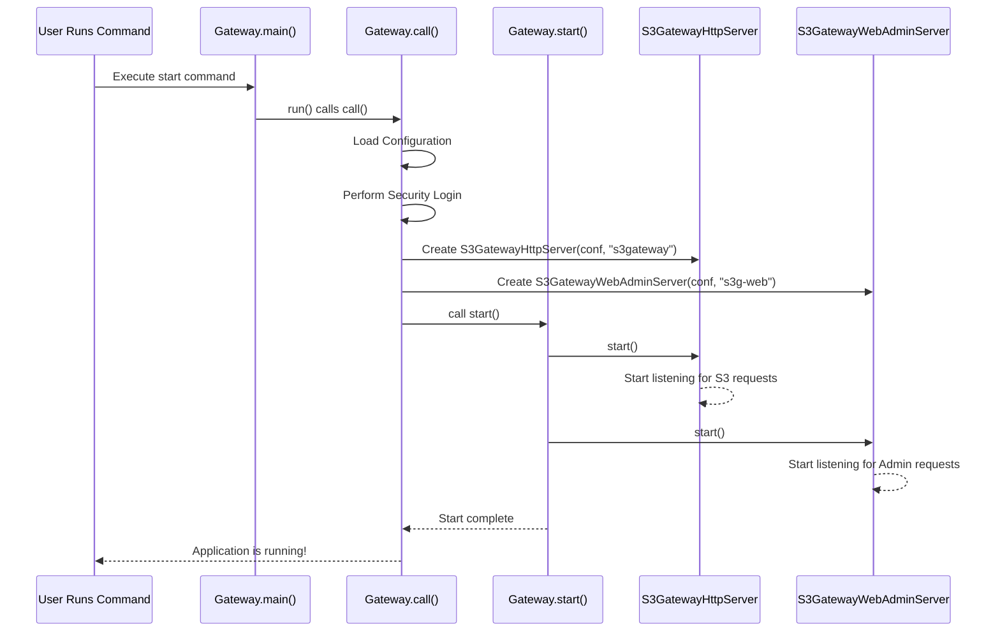

# Chapter 1: Gateway and Servers

Welcome to the first chapter of our tutorial on the `s3gateway` project! In this chapter, we'll explore the very foundation of the S3 Gateway application: how it starts up and gets ready to receive requests.

Imagine you're building a house that will be a service center. Before anyone can come in and ask for help, the house needs to be built, and doors need to be opened with people ready to listen. In the world of `s3gateway`, this "building" and "opening the doors" is handled by the **Gateway** class and its associated **Servers**.

The core job of `s3gateway` is to translate requests that look like Amazon S3 requests into commands that Apache Ozone understands. To do this, it needs to constantly listen for incoming requests over the internet using the HTTP protocol.

So, the problem this concept solves is simple but fundamental: **How does the S3 Gateway application start, and how does it receive incoming requests?**

Let's break this down into the key players:

1.  **The `Gateway` Class:** Think of this as the main controller or the "building manager." When you start the S3 Gateway application, you are essentially telling the `Gateway` class to get everything ready. It's the initial entry point that kicks off the whole process.
2.  **`S3GatewayHttpServer`:** This is the main "front desk" of our service center. Its specific job is to listen for the actual S3-compatible requests (like "List my storage buckets," "Upload a file," etc.) that users send. This server speaks the language of the S3 API.
3.  **`S3GatewayWebAdminServer`:** This is a separate "administrative office" within the building. It handles different kinds of requests, primarily related to managing and monitoring the S3 Gateway itself (like checking its status). Keeping this separate from the main S3 request handler is good practice for organization and security.

So, the `Gateway` class is responsible for starting these two important servers, allowing the S3 Gateway to listen on different network ports for different types of requests.

### How it Starts: The Main Entry Point

When you run the `s3gateway` application, the first code that executes is the standard Java `main` method inside the `Gateway` class. This is the standard way any Java application begins.

Here's a simplified look at the `main` method:

```java
// Simplified snippet from src/main/java/org/apache/hadoop/ozone/s3/Gateway.java
public class Gateway extends GenericCli implements Callable<Void> {

  public static void main(String[] args) throws Exception {
    // Basic setup, network configuration
    OzoneNetUtils.disableJvmNetworkAddressCacheIfRequired(
            new OzoneConfiguration());
    // Creates a Gateway instance and runs it
    new Gateway().run(args);
  }

  // ... other methods ...
}
```

This `main` method is very minimal. Its primary job is to set up some basic things and then create a `Gateway` object and tell it to `run`. The `run` method comes from `GenericCli`, a helper for command-line applications. It eventually calls the `call()` method of our `Gateway` class.

### The `call()` Method: Getting Ready

The real work of initialization starts in the `call()` method. This is where the `Gateway` class loads its configuration, sets up security (which we'll cover in [S3 Authentication and Authorization](03_s3_authentication_and_authorization_.md)), and importantly, creates instances of the two server classes.

Let's look at a simplified snippet from the `call()` method:

```java
// Simplified snippet from src/main/java/org/apache/hadoop/ozone/s3/Gateway.java
@Command(/* ... */) // This marks the class for command-line parsing
public class Gateway extends GenericCli implements Callable<Void> {

  private S3GatewayHttpServer httpServer; // Variable to hold the S3 server
  private BaseHttpServer contentServer;   // Variable to hold the admin server

  @Override
  public Void call() throws Exception {
    // Load configuration (details in Chapter 9: Configuration Management)
    OzoneConfiguration ozoneConfiguration = getOzoneConf();
    // ... security setup (details in Chapter 3: S3 Authentication and Authorization)
    loginS3GUser(OzoneConfigurationHolder.configuration());
    // ... tracing, metrics, etc.

    // Create the two server instances!
    httpServer = new S3GatewayHttpServer(OzoneConfigurationHolder.configuration(), "s3gateway");
    contentServer = new S3GatewayWebAdminServer(OzoneConfigurationHolder.configuration(), "s3g-web");

    // Now, start the servers
    start();

    // Add a hook to stop everything cleanly when the application is shut down
    ShutdownHookManager.get().addShutdownHook(() -> { /* stop logic */ }, DEFAULT_SHUTDOWN_HOOK_PRIORITY);

    return null; // Indicate success
  }

  // ... other methods ...
}
```

See those two lines where `httpServer` and `contentServer` are created? That's where our "front desk" (`S3GatewayHttpServer`) and "administrative office" (`S3GatewayWebAdminServer`) are set up using the loaded configuration.

After creating them, the `call()` method calls the `start()` method of the `Gateway` class itself.

### Starting the Servers: Opening the Doors

The `Gateway.start()` method is straightforward. Its main job is to call the `start()` method on the server objects we just created. Calling `start()` on `S3GatewayHttpServer` and `S3GatewayWebAdminServer` tells them to bind to their configured network ports and begin listening for incoming HTTP requests.

Here's a look at the `Gateway.start()` method:

```java
// Simplified snippet from src/main/java/org/apache/hadoop/ozone/s3/Gateway.java
public class Gateway extends GenericCli implements Callable<Void> {

  // ... server variables and call() method ...

  public void start() throws IOException {
    LOG.info("Starting Ozone S3 gateway");
    // ... metrics initialization ...
    jvmPauseMonitor.start(); // Monitoring thread
    httpServer.start();   // Start the S3 API server!
    contentServer.start(); // Start the Web Admin server!
    LOG.info("Ozone S3 gateway started.");
  }

  // ... other methods ...
}
```

And just like that, with `httpServer.start()` and `contentServer.start()`, our S3 Gateway application is listening for requests!

### The Servers in Detail

Both `S3GatewayHttpServer` and `S3GatewayWebAdminServer` extend a common base class called `BaseHttpServer`. This base class provides the core functionality for setting up and managing an HTTP server using the Jetty library (a popular embedded web server).

*   **`S3GatewayHttpServer`**: This server is configured to listen on specific ports (defined in the configuration, see [Configuration Management](09_configuration_management_.md)) and is where all S3 API requests will arrive. When a request comes in (like a command to list buckets), this server receives it and passes it along for processing (which we'll discuss in the next chapter). It doesn't serve any static web content by default (`shouldAddDefaultApps()` returns false).

*   **`S3GatewayWebAdminServer`**: This server is configured to listen on a *different* set of ports. It handles requests for the web-based administrative interface and other utility endpoints. It also handles specific endpoints like `/secret/*` which requires additional authentication setup.

The separation allows for different network access rules or security configurations for the S3 API (which is exposed to clients) versus the administrative interface (which might only be for operators).

### Stepping Through the Process

Let's visualize the startup process with a simple sequence diagram:



This diagram shows how the user's command triggers the `Gateway`'s main method, which then orchestrates the initialization steps, including creating and starting the two crucial HTTP servers.

### Conclusion

In this first chapter, we learned that the `s3gateway` application begins execution in the `Gateway` class's `main` method. The `Gateway` then initializes the system and, most importantly, creates and starts two distinct HTTP servers: `S3GatewayHttpServer` for handling S3-compatible API requests and `S3GatewayWebAdminServer` for administrative tasks and web content. These servers open the necessary network ports, allowing the application to receive requests.

Now that our S3 Gateway is running and listening, how does it figure out what to do when a request arrives? That's the topic of our next chapter, which dives into how incoming requests are processed and filtered.

[Chapter 2: Request Processing Filters](02_request_processing_filters_.md)

---

Generated by [AI Codebase Knowledge Builder](https://github.com/The-Pocket/Tutorial-Codebase-Knowledge)