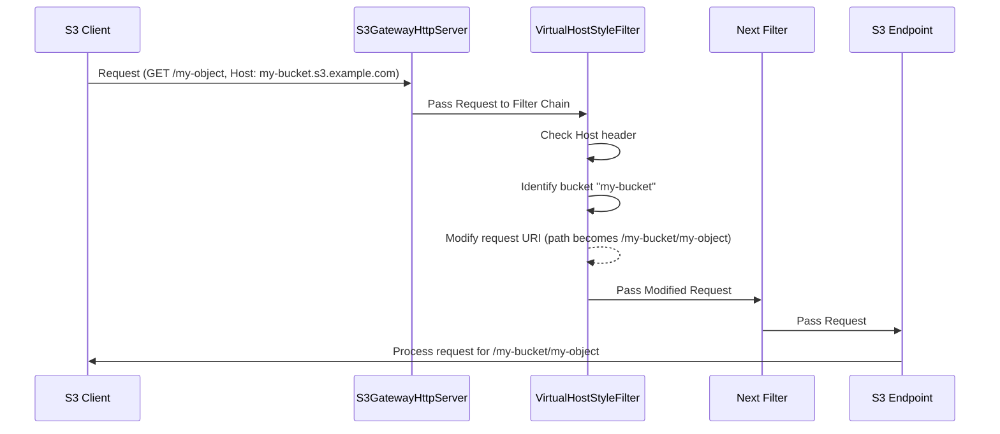

# Chapter 2: Request Processing Filters

Welcome back! In [Chapter 1: Gateway and Servers](01_gateway_and_servers_.md), we saw how the `s3gateway` application starts up and opens its "doors" (HTTP servers) to listen for incoming requests. Now that a request has arrived at the door, what happens next?

Imagine a letter arriving at a big office building. It doesn't just immediately go to the person it's addressed to. It first goes through a mailroom:
*   Someone checks the address format (is it a standard address or a P.O. Box?).
*   Maybe they add a tracking sticker.
*   They might check for obvious security issues (like weird smells!).
*   They sort it based on the department.

Only *after* all these initial steps does the letter finally reach the right desk in the right department.

In `s3gateway`, incoming S3 requests go through a similar process. They don't immediately hit the code that lists buckets or uploads files. Instead, they pass through a series of processing steps called **Request Processing Filters**.

The problem this concept solves is: **How can the S3 Gateway perform common tasks on every incoming request (and outgoing response) before the request reaches the specific logic that handles, say, a 'GetObject' or 'PutObject' command?**

Filters are like checkpoints or middleware that sit in between the raw incoming request and the final "endpoint" logic. They form a **processing pipeline**.

## What are Filters?

Think of filters as layers of logic that wrap the core request handling. When a request arrives, it passes through the first filter, then the second, and so on, before finally reaching the piece of code (the "resource method" or "endpoint") designed to handle that specific type of S3 operation (like listing buckets or getting an object). When the endpoint is finished and generates a response, the response might also pass back through some filters on its way out.

`s3gateway` uses the filter mechanism provided by the JAX-RS framework (specifically, the Jersey implementation) that it uses to build its REST API.

Here are some of the important tasks these filters handle in `s3gateway`:

1.  **Parsing different S3 request styles:** S3 supports requests like `http://<bucket-name>.<s3-domain>/<object-key>` (Virtual Host style) and `http://<s3-domain>/<bucket-name>/<object-key>` (Path style). A filter needs to normalize this so the main logic only deals with one consistent format (usually Path style).
2.  **Adjusting Headers:** Sometimes, client libraries send headers in slightly different ways, or the gateway needs to add information. Filters can modify request or response headers.
3.  **Identifying the Client's IP:** Knowing the original client IP is important for logging or security, especially if the gateway is behind a proxy.
4.  **Adding Common Response Headers:** Every S3 response needs certain headers (like request IDs). A filter can add these automatically.
5.  **Managing Tracing:** To understand how a request flows through the system, tracing helps. Filters can start and stop tracing spans for each request.
6.  **Security Checks:** Filters are an ideal place to check if the request is authenticated and authorized before it reaches sensitive endpoint logic. (We'll cover this in [Chapter 3: S3 Authentication and Authorization](03_s3_authentication_and_authorization_.md)).
7.  **Endpoint-Specific Logic:** Some filters only apply to specific endpoints or add logic based on annotations on the endpoint code.

Let's look at a common S3 feature handled by a filter: **Virtual Host Style Requests**.

## Use Case: Handling Virtual Host Style Requests

A common way S3 clients address resources is using the bucket name as part of the hostname, like `http://my-bucket.s3.example.com/my-object`. This is the **Virtual Host style**. The alternative is the **Path style**, like `http://s3.example.com/my-bucket/my-object`.

S3 Gateway needs to understand both styles, but the internal logic often works best with the Path style format (where the bucket is part of the path). A filter is the perfect place to convert the Virtual Host style into the Path style *before* any other part of the system needs to know the bucket and object.

This is handled by the `VirtualHostStyleFilter`.

## How the VirtualHostStyleFilter Works

When `s3gateway` receives a request like `GET /my-object HTTP/1.1` with a `Host` header of `my-bucket.s3.example.com`, the `VirtualHostStyleFilter` is one of the first pieces of code that looks at it.

1.  The filter checks the `Host` header (`my-bucket.s3.example.com`).
2.  It compares this against configured domain names (like `s3.example.com`).
3.  If it finds a match (`s3.example.com`), it figures out that the part *before* the domain (`my-bucket`) must be the bucket name.
4.  It then modifies the *request URI* internally. It changes the path from `/my-object` to `/my-bucket/my-object`.

After this filter runs, the request looks like a Path style request (`GET /my-bucket/my-object ... Host: s3.example.com`) to the filters that run later and to the final endpoint logic.

Let's see a simplified flow:



This diagram shows how the `VirtualHostStyleFilter` intercepts the request and changes its perceived path before it moves down the filter chain towards the final endpoint.

## Looking at Filter Code

Filters in `s3gateway` are typically Java classes that implement interfaces like `ContainerRequestFilter` (for processing requests *before* they hit the endpoint) or `ContainerResponseFilter` (for processing responses *after* the endpoint has generated them).

They often have annotations like `@Provider` (tells the framework this is a filter), `@PreMatching` (tells it to run early in the process, before routing the request to a specific endpoint method), and `@Priority` (determines the order in which filters run). A lower priority number means the filter runs *earlier*.

Here's a simplified look at the `VirtualHostStyleFilter`:

```java
// Simplified snippet from src/main/java/org/apache/hadoop/ozone/s3/VirtualHostStyleFilter.java
@Provider // This class is a JAX-RS provider (a filter)
@PreMatching // Run this filter before figuring out which specific S3 operation (endpoint) is requested
@Priority(VirtualHostStyleFilter.PRIORITY) // Controls the order this filter runs in
public class VirtualHostStyleFilter implements ContainerRequestFilter {

  // PRIORITY value ensures this runs early

  @Inject // Automatically provided by the framework
  private OzoneConfiguration conf;

  @Override
  public void filter(ContainerRequestContext requestContext) throws
      IOException {

    // 1. Get configured S3 domain names (e.g., "s3.example.com")
    String[] domains = conf.getTrimmedStrings(OZONE_S3G_DOMAIN_NAME);
    if (domains.length == 0) {
      return; // No domains configured, skip this filter
    }

    // 2. Get the Host header from the incoming request
    String host = requestContext.getHeaderString(HttpHeaders.HOST);
    host = checkHostWithoutPort(host); // Handle cases like "host:port"

    // 3. Find if the host ends with one of the configured domain names
    String domain = getDomainName(host);

    if (domain == null) {
      // No matching domain found, maybe it's already Path style or an invalid request
      // ... (error handling or just let it pass if domains not strictly required)
      return;
    }

    // 4. Check if it's Virtual Host style (host is longer than the domain)
    if (host.length() > domain.length()) {
      // Extract the bucket name part (e.g., "my-bucket" from "my-bucket.s3.example.com")
      String bucketName = host.substring(0, host.length() - domain.length());
      // ... (validation, handle trailing dot)

      // 5. Modify the request URI! Prepend "/bucketName" to the path.
      URI baseURI = requestContext.getUriInfo().getBaseUri(); // e.g., http://s3.example.com:9878
      String currentPath = requestContext.getUriInfo().getPath(); // e.g., "/my-object"
      String newPath = bucketName; // Start with the bucket name
      if (currentPath != null) {
        newPath += currentPath; // Add the original path (e.g., "/my-bucket/my-object")
      }

      // Build the new URI and set it on the request context
      URI requestAddr = UriBuilder.fromUri(baseURI).path(newPath)
                       .replaceQuery(requestContext.getUriInfo().getRequestUri().getRawQuery())
                       .build();
      requestContext.setRequestUri(baseURI, requestAddr);

      LOG.debug("Converted virtual host request to path style: {}", requestAddr);
    }
  }

  // ... helper methods like getDomainName and checkHostWithoutPort ...
}
```

This simplified code shows the core logic: it gets the `Host` header, extracts the potential bucket name, and then uses `requestContext.setRequestUri` to change the URI that the rest of the application sees. This is the power of filters – they can modify the request *in flight*.

## Other Examples of Filters

`s3gateway` uses several other filters for various purposes:

*   **`HeaderPreprocessor`**: This filter runs after the `VirtualHostStyleFilter` (due to its `@Priority`). It looks for specific query parameters like `?delete` or `?uploadId` and adjusts the `Content-Type` header. Why? Because some S3 client tools send a default or incorrect `Content-Type` for these specific operations, and this filter corrects it so the request is routed correctly by the framework.

    ```java
    // Simplified snippet from src/main/java/org/apache/hadoop/ozone/s3/HeaderPreprocessor.java
    @Provider
    @PreMatching
    @Priority(HeaderPreprocessor.PRIORITY) // Runs after VirtualHostStyleFilter
    public class HeaderPreprocessor implements ContainerRequestFilter {
        @Override
        public void filter(ContainerRequestContext requestContext) throws IOException {
            MultivaluedMap<String, String> queryParameters =
                requestContext.getUriInfo().getQueryParameters();

            // Save original Content-Type if present
            if (requestContext.getHeaderString(CONTENT_TYPE) != null) {
              requestContext.getHeaders().putSingle(ORIGINAL_CONTENT_TYPE,
                  requestContext.getHeaderString(CONTENT_TYPE));
            }

            // If "?delete" is in the query, force Content-Type to application/xml
            if (queryParameters.containsKey("delete")) {
                requestContext.getHeaders().putSingle(CONTENT_TYPE, MediaType.APPLICATION_XML);
            }
            // Similarly for "?uploadId"
            if (queryParameters.containsKey("uploadId")) {
                 requestContext.getHeaders().putSingle(CONTENT_TYPE, MediaType.APPLICATION_XML);
            }
            // ... and for "?uploads" (multipart upload initiation)
            else if (queryParameters.containsKey("uploads")) {
                requestContext.getHeaders().putSingle(CONTENT_TYPE, MULTIPART_UPLOAD_MARKER);
            }
        }
        // ... constants ...
    }
    ```
    This filter demonstrates modifying headers based on query parameters, ensuring compatibility with various S3 clients.

*   **`ClientIpFilter`**: This filter determines the client's true IP address. It checks common headers like `x-real-ip` or `x-forwarded-for` (often set by proxies or load balancers) before falling back to the direct connection's remote address. It then adds this IP to the request headers for later use (e.g., logging).

    ```java
    // Simplified snippet from src/main/java/org/apache/hadoop/ozone/s3/ClientIpFilter.java
    @Provider
    @PreMatching
    @Priority(ClientIpFilter.PRIORITY) // Runs after HeaderPreprocessor
    public class ClientIpFilter implements ContainerRequestFilter {

      public static final String CLIENT_IP_HEADER = "client_ip";

      @Context // Injects the underlying HttpServletRequest
      private HttpServletRequest httpServletRequest;

      @Override
      public void filter(ContainerRequestContext request) throws IOException {
        String clientIp = httpServletRequest.getHeader("x-real-ip");

        if (clientIp == null || clientIp.isEmpty()) {
          clientIp = httpServletRequest.getHeader("x-forwarded-for");
          String[] ips = clientIp == null ? null : clientIp.split(",");
          clientIp = (ips == null || ips.length == 0) ? null : ips[0];
        }

        // If still not found, use the direct remote address
        clientIp = (clientIp == null || clientIp.isEmpty()) ?
            httpServletRequest.getRemoteAddr() : clientIp;

        // Add the found IP to the request headers for internal use
        request.getHeaders().putSingle(CLIENT_IP_HEADER, clientIp);
      }
    }
    ```
    This filter shows how context information (like the underlying HTTP request) can be injected and used, and how filters can add new information to the request headers for subsequent processing steps.

*   **`TracingFilter`**: This filter integrates with tracing systems (like Jaeger). On an incoming request, it starts a new tracing span. On an outgoing response, it finishes the span, allowing developers to see the timeline of how a request was processed.

    ```java
    // Simplified snippet from src/main/java/org/apache/hadoop/ozone/s3/TracingFilter.java
    @Provider
    public class TracingFilter implements ContainerRequestFilter, ContainerResponseFilter {

      // ... constants for properties ...

      @Context // Injects info about the resource method that will handle the request
      private ResourceInfo resourceInfo;

      @Override
      public void filter(ContainerRequestContext requestContext) {
        // Start a new tracing span for this request
        Span span = GlobalTracer.get().buildSpan(/* span name based on endpoint */).start();
        Scope scope = GlobalTracer.get().activateSpan(span);
        // Store span/scope in request context for later access
        requestContext.setProperty(TRACING_SCOPE, scope);
        requestContext.setProperty(TRACING_SPAN, span);
      }

      @Override
      public void filter(ContainerRequestContext requestContext,
                         ContainerResponseContext responseContext) {
        // Retrieve the span/scope stored during the request phase
        final Scope scope = (Scope) requestContext.getProperty(TRACING_SCOPE);
        final Span span = (Span) requestContext.getProperty(TRACING_SPAN);

        // Finish and close the tracing span
        finishAndClose(scope, span); // Helper method
      }
      // ... finishAndClose helper ...
    }
    ```
    This filter demonstrates handling both incoming requests (`ContainerRequestFilter`) and outgoing responses (`ContainerResponseFilter`) and how data can be passed between the request and response phases using `requestContext.setProperty`.

*   **`CommonHeadersContainerResponseFilter`**: This is a response filter. It runs *after* the endpoint has generated the response but *before* the response is sent back to the client. It adds standard S3-like headers such as `Server`, `x-amz-id-2`, and `x-amz-request-id`.

    ```java
    // Simplified snippet from src/main/java/org/apache/hadoop/ozone/s3/CommonHeadersContainerResponseFilter.java
    @Provider
    public class CommonHeadersContainerResponseFilter implements ContainerResponseFilter {

      @Inject // Injects a helper class to get request/amz IDs
      private RequestIdentifier requestIdentifier;

      @Override
      public void filter(ContainerRequestContext containerRequestContext,
          ContainerResponseContext containerResponseContext) throws IOException {

        // Add common headers to the outgoing response
        containerResponseContext.getHeaders().add("Server", "Ozone");
        containerResponseContext.getHeaders()
            .add("x-amz-id-2", requestIdentifier.getAmzId());
        containerResponseContext.getHeaders()
            .add("x-amz-request-id", requestIdentifier.getRequestId());
      }
    }
    ```
    This simple filter shows how response headers are modified using `containerResponseContext.getHeaders().add()`.

You also see filters related to security (`AuthorizationFilter`, `S3SecretAdminFilter`, `S3SecretEnabledEndpointRequestFilter`) in the code snippets provided in the context. These are critical but involve more complex logic covered in [Chapter 3: S3 Authentication and Authorization](03_s3_authentication_and_authorization_.md) and potentially later chapters regarding the S3 secret management endpoints. They often use annotations like `@S3AdminEndpoint` or `@S3SecretEnabled` to apply only to specific resource methods or classes.

The key takeaway is that each filter performs a specific, well-defined task in the request/response processing pipeline, keeping the core S3 endpoint logic focused on the business of interacting with Ozone.

## Conclusion

In this chapter, we learned about **Request Processing Filters** in `s3gateway`. These filters act as a pipeline, processing incoming requests and outgoing responses before they reach the main endpoint logic or are sent back to the client. They handle essential tasks like parsing virtual host style URLs, adjusting headers, identifying client IPs, adding common response headers, and managing tracing. This modular approach keeps the main S3 endpoint code cleaner and more focused.

Understanding filters is crucial because they perform fundamental operations, including security checks, which is the topic of our next chapter.

[Chapter 3: S3 Authentication and Authorization](03_s3_authentication_and_authorization_.md)

---

Generated by [AI Codebase Knowledge Builder](https://github.com/The-Pocket/Tutorial-Codebase-Knowledge)