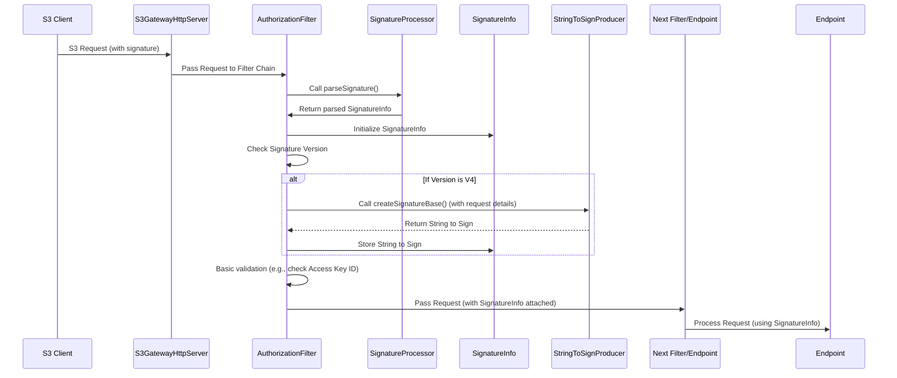

# Chapter 3: S3 Authentication and Authorization

Welcome back to our tutorial on the `s3gateway` project! In [Chapter 1: Gateway and Servers](01_gateway_and_servers_.md), we saw how the gateway starts and listens for requests. In [Chapter 2: Request Processing Filters](02_request_processing_filters_.md), we learned how incoming requests pass through a pipeline of filters that perform common tasks like fixing headers or parsing URLs.

Now, one of the *most* critical tasks that happens early in that filter pipeline is security: verifying *who* is making the request and whether they are *allowed* to do what they are asking.

Imagine our S3 Gateway service center again. Before any service is provided (like getting a file or listing buckets), a request arrives. Someone needs to check the client's ID and make sure they have permission to access the requested service. This is the job of **Authentication and Authorization**.

*   **Authentication:** Proving your identity. (Who are you?)
*   **Authorization:** Checking your permissions. (What are you allowed to do?)

The problem this concept solves is fundamental: **How does the S3 Gateway verify the identity of a client making an S3 request and ensure they have the necessary permissions to perform the requested operation?**

S3 (and by extension, `s3gateway`) primarily uses cryptographic **signatures** for authentication. Instead of sending a password with every request, clients use their secret key to create a unique signature for that specific request. The server (our `s3gateway`) can then use the client's *public* access key to verify that the signature is valid and the request hasn't been tampered with.

This signature process is like a digital fingerprint for the request, proving it came from someone holding the corresponding secret key.

## The Gatekeeper: The `AuthorizationFilter`

Just as discussed in the previous chapter, a Filter is the perfect place to handle this cross-cutting concern. The `s3gateway` uses an `AuthorizationFilter` which runs early in the request processing pipeline ([Priority 50]). This filter is the initial gatekeeper.

Its core job is to intercept the incoming request, find the signature information, parse it, and extract the client's identity (like their Access Key ID).

Let's look at the `AuthorizationFilter`'s `filter` method (simplified):

```java
// Simplified snippet from src/main/java/org/apache/hadoop/ozone/s3/AuthorizationFilter.java
@Provider
@PreMatching // Run early in the filter chain
@Priority(AuthorizationFilter.PRIORITY) // PRIORITY = 50
public class AuthorizationFilter implements ContainerRequestFilter {

  @Inject
  private SignatureProcessor signatureProcessor; // Used to parse the signature

  @Inject
  private SignatureInfo signatureInfo; // Holds the parsed signature details

  @Override
  public void filter(ContainerRequestContext context) throws IOException {
    try {
      // Step 1: Parse the signature from the request (headers/query params)
      signatureInfo.initialize(signatureProcessor.parseSignature());

      // Step 2 (For V4): Create the "String to Sign"
      if (signatureInfo.getVersion() == Version.V4) {
        signatureInfo.setStrToSign(
            StringToSignProducer.createSignatureBase(signatureInfo, context));
      }
      // Step 3: Basic Validation - Check if Access Key ID is present
      String awsAccessId = signatureInfo.getAwsAccessId();
      if (awsAccessId == null || awsAccessId.isEmpty()) {
        LOG.debug("Malformed s3 header. awsAccessID: {}", awsAccessId);
        throw ACCESS_DENIED; // Reject if no Access Key ID is found
      }
    } catch (OS3Exception ex) {
       // Handle S3-specific errors
       throw wrapOS3Exception(ex);
    } catch (Exception e) {
       // Handle unexpected errors
       throw wrapOS3Exception(S3ErrorTable.newError(INTERNAL_ERROR, null, e));
    }
  }
  // ... other methods ...
}
```

This simplified snippet shows the filter's primary flow: it uses a `SignatureProcessor` to *parse* the signature from the incoming request, then stores the result in a `SignatureInfo` object. For AWS Signature Version 4 (V4), it also calculates the "string to sign" using `StringToSignProducer`. Finally, it performs a very basic check: ensure an Access Key ID was found. If not, it rejects the request with an `ACCESS_DENIED` error.

Notice how the filter uses dependency injection (`@Inject`) to get instances of `SignatureProcessor` and `SignatureInfo`. These are singletons (or request-scoped) provided by the framework.

Let's look at the key players involved:

1.  **`SignatureProcessor` (`AWSSignatureProcessor`):** The main logic for *finding* and *extracting* signature details from the raw HTTP request (headers or query parameters).
2.  **`SignatureInfo`:** A simple container class that holds all the pieces of information parsed from the signature (like the Access Key ID, the signature value itself, the signing version (V4/V2), signed headers, etc.).
3.  **`StringToSignProducer`:** A helper that takes details from a V4 request and formats them into a specific string format required as input for the V4 signature calculation.

Here's a simple flow diagram showing the filter's role:



This diagram illustrates how the `AuthorizationFilter` orchestrates the initial steps of parsing the signature and preparing the authentication information (`SignatureInfo`) before the request proceeds.

## Parsing the Signature: The `AWSSignatureProcessor`

The `AWSSignatureProcessor` is responsible for looking at the request and figuring out which type of S3 signature is being used (AWS Signature V4 or V2) and then extracting the relevant data. It does this by trying different specialized "parsers".

```java
// Simplified snippet from src/main/java/org/apache/hadoop/ozone/s3/signature/AWSSignatureProcessor.java
@RequestScoped // A new instance for each request
public class AWSSignatureProcessor implements SignatureProcessor {

  @Context // Injects the request context
  private ContainerRequestContext context;

  @Override
  public SignatureInfo parseSignature() throws OS3Exception {
    // Get request headers (case-insensitive map helper)
    LowerCaseKeyStringMap headers = LowerCaseKeyStringMap.fromHeaderMap(context.getHeaders());
    String authHeader = headers.get("Authorization"); // Get the Authorization header

    // List of potential signature parsers to try
    List<SignatureParser> signatureParsers = new ArrayList<>();
    signatureParsers.add(new AuthorizationV4HeaderParser(authHeader, headers.get(StringToSignProducer.X_AMZ_DATE)));
    signatureParsers.add(new AuthorizationV4QueryParser(
        StringToSignProducer.fromMultiValueToSingleValueMap(context.getUriInfo().getQueryParameters())));
    signatureParsers.add(new AuthorizationV2HeaderParser(authHeader));

    SignatureInfo signatureInfo = null;
    // Try each parser until one successfully finds and parses a signature
    for (SignatureParser parser : signatureParsers) {
      try {
        signatureInfo = parser.parseSignature();
        if (signatureInfo != null) {
          break; // Found a valid signature format, stop trying
        }
      } catch (MalformedResourceException e) {
        // Log authentication failures but continue trying other parsers
        LOG.debug("Malformed resource during signature parsing: {}", e.getResource());
        // Note: Original code logs audit failure and rethrows MalformedResourceException here,
        // which would stop processing. Simplified here to show trying parsers.
      }
    }

    // If no parser succeeded, return a default SignatureInfo indicating no signature
    if (signatureInfo == null) {
      signatureInfo = new SignatureInfo.Builder(Version.NONE).build();
    }

    // Store the original URI path before filters might change it (like VirtualHostStyleFilter)
    signatureInfo.setUnfilteredURI(context.getUriInfo().getRequestUri().getPath());

    return signatureInfo;
  }
  // ... helper methods ...
}
```

This code shows the strategy: create different `SignatureParser` objects for the expected signature formats (V4 in header, V4 in query, V2 in header) and iterate through them. The first one that successfully `parseSignature()` returns a `SignatureInfo`, and the process stops. If none match, it creates a `SignatureInfo` with version `NONE`.

## Storing Signature Details: The `SignatureInfo`

The `SignatureInfo` class is a simple data structure that holds all the important pieces of information extracted from the signature. This includes things like:

*   `Version` (V4, V2, or NONE)
*   `awsAccessId`: The client's Access Key ID.
*   `signature`: The signature string provided by the client.
*   `signedHeaders` (V4): A list of headers included in the V4 signature calculation.
*   `credentialScope` (V4): Details about the date, region, and service used in the V4 signature.
*   `stringToSign` (V4): The specific string used as input for the V4 signature calculation.

```java
// Simplified snippet from src/main/java/org/apache/hadoop/ozone/s3/signature/SignatureInfo.java
@RequestScoped // A new instance for each request
public class SignatureInfo {

  private Version version;
  private String date; // Date only from credential
  private String dateTime; // Full timestamp from header/query
  private String awsAccessId;
  private String signature;
  private String signedHeaders;
  private String credentialScope;
  private String algorithm;
  private boolean signPayload = true; // Whether payload was signed
  private String unfilteredURI = null; // Original URI before filters
  private String stringToSign = null; // V4 string to sign

  // Constructor, getters, setters, and Builder pattern
  // ... (removed for brevity)

  public enum Version {
    NONE, V4, V2;
  }

  // ... Builder class (removed for brevity)
}
```

An instance of this `SignatureInfo` is typically request-scoped (`@RequestScoped` annotation) meaning a new one is created for each incoming request. The `AuthorizationFilter` populates it, and other parts of the request processing pipeline (including the actual signature validation logic, which is not fully shown in the provided snippets) can access it via dependency injection.

## Creating the String to Sign (for V4): `StringToSignProducer`

For AWS Signature Version 4, the server needs to recreate a very specific string called the "string to sign". This string is a standardized representation of the incoming request, including the HTTP method, URI, query parameters, canonical headers, signed headers list, and the hash of the request body. The server calculates its own signature using this string and the client's secret key and compares it to the signature provided by the client. If they match, the request is authenticated.

The `StringToSignProducer` is a utility class that constructs this "string to sign".

```java
// Simplified snippet from src/main/java/org/apache/hadoop/ozone/s3/signature/StringToSignProducer.java
public final class StringToSignProducer {

  // ... constants and helper methods ...

  public static String createSignatureBase(
      SignatureInfo signatureInfo,
      ContainerRequestContext context // Provides request details
  ) throws Exception {
    // This method gathers all necessary information from the request context
    // and the parsed SignatureInfo...
    String scheme = context.getUriInfo().getRequestUri().getScheme();
    String method = context.getMethod();
    // Use the unfiltered URI stored by the filter
    String uri = signatureInfo.getUnfilteredURI();
    // Use the case-insensitive headers parsed by the processor
    LowerCaseKeyStringMap headers =
        LowerCaseKeyStringMap.fromHeaderMap(context.getHeaders());
    // Use single-value query parameters
    Map<String, String> queryParams =
        fromMultiValueToSingleValueMap(context.getUriInfo().getQueryParameters());

    // ... and calls buildCanonicalRequest to format the request details ...
    String canonicalRequest = buildCanonicalRequest(
        scheme, method, uri, signatureInfo.getSignedHeaders(),
        headers, queryParams, !signatureInfo.isSignPayload());

    // ... then hashes the canonical request ...
    String hashedCanonicalRequest = hash(canonicalRequest);

    // ... and finally combines everything into the StringToSign
    StringBuilder strToSign = new StringBuilder();
    strToSign.append(signatureInfo.getAlgorithm()).append(NEWLINE); // Algorithm
    strToSign.append(signatureInfo.getDateTime()).append(NEWLINE);  // Request Timestamp
    strToSign.append(signatureInfo.getCredentialScope()).append(NEWLINE); // Credential Scope
    strToSign.append(hashedCanonicalRequest); // Hash of the canonical request

    LOG.debug("StringToSign:[{}]", strToSign);
    return strToSign.toString();
  }

  // ... buildCanonicalRequest and other helper methods (removed for brevity)
}
```

This shows that `StringToSignProducer` takes information about the request and the parsed signature details (`SignatureInfo`), constructs the `canonicalRequest` string internally (a standardized format of the request), hashes it, and then combines it with other V4 specific data (algorithm, timestamp, credential scope) to create the final "string to sign".

## Beyond Parsing: Validation and Authorization

The `AuthorizationFilter` and its helpers (`SignatureProcessor`, `SignatureInfo`, `StringToSignProducer`) are primarily focused on *parsing* the signature information and identifying the user (Authentication).

What happens *after* this?

1.  **Signature Validation:** The system needs to look up the user's secret key (associated with the extracted `awsAccessId`). Using this secret key, it recalculates the signature based on the "string to sign" (for V4) or other relevant request details (for V2). It then compares this calculated signature with the signature provided by the client. If they match, authentication is successful – we know *who* made the request and that the request wasn't modified. If they don't match, the request is rejected (often with an `InvalidSignature` error).
2.  **Authorization:** Once the client's identity is verified, the system needs to check if this user has permission to perform the specific action requested (e.g., read from this bucket, delete this object). This authorization check involves comparing the user's identity and the requested operation against the permission policies configured in Apache Ozone. This is typically done by the code in the specific S3 endpoint that handles the request (covered in [Chapter 4: S3 Endpoints](04_s3_endpoints_.md)), often interacting with the [Ozone Client](05_ozone_client_.md) to perform the permission check.

So, while the `AuthorizationFilter` kicks off the security process by parsing the authentication details, the full authentication (signature verification) and authorization (permission check) are completed in subsequent steps of the request pipeline.

## Conclusion

In this chapter, we explored how `s3gateway` handles the initial steps of S3 Authentication and Authorization. We learned about the `AuthorizationFilter` which acts as the gatekeeper, running early in the filter chain. This filter uses the `SignatureProcessor` to parse signature details (AWS Signature V4 and V2) from the incoming request. The extracted information, including the client's Access Key ID, is stored in a `SignatureInfo` object. For V4 requests, the `StringToSignProducer` helps format request details into the "string to sign" required for signature verification. While this chapter focused on the *parsing* and *identification* part (Authentication), we touched upon how the system later validates the signature and performs permission checks (Authorization) using the identified user's information.

With the client's identity now verified, the request is ready to be handled by the specific logic designed for the requested S3 operation. That's what we'll explore in the next chapter.

[Chapter 4: S3 Endpoints](04_s3_endpoints_.md)

---

Generated by [AI Codebase Knowledge Builder](https://github.com/The-Pocket/Tutorial-Codebase-Knowledge)