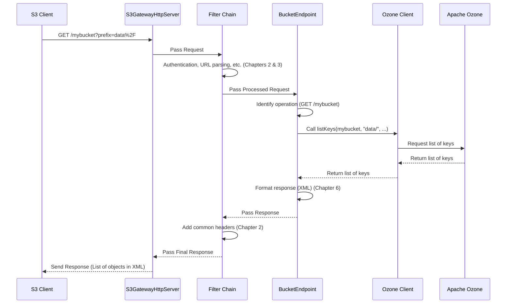

# Chapter 4: S3 Endpoints

Welcome back! In [Chapter 1: Gateway and Servers](01_gateway_and_servers_.md), we learned how the `s3gateway` starts and listens for requests. [Chapter 2: Request Processing Filters](02_request_processing_filters_.md) showed how requests pass through a series of common processing steps. [Chapter 3: S3 Authentication and Authorization](03_s3_authentication_and_authorization_.md) explained how the gateway verifies who is making the request.

Now that a request has been received, filtered, and authenticated, the S3 Gateway needs to figure out what specific action the client wants to perform and execute the code that handles that action. Does the client want to list buckets, create a bucket, upload a file, download a file, or something else?

Imagine our service center again. A customer has arrived, been greeted at the front desk (Server), had their request slip checked and validated (Filters), and shown their ID (Authentication). Now they need to go to the specific counter or station that can actually *do* what they need – like the "File Upload Counter," the "Account Information Desk," or the "Billing Station."

In `s3gateway`, these "specific counters" are implemented by classes called **S3 Endpoints**.

The problem this concept solves is: **How does the S3 Gateway route an authenticated and filtered incoming S3 request to the correct logic that performs the specific S3 operation requested by the client?**

S3 Endpoints are the core classes that contain the actual implementation code for each distinct S3 API operation. They are responsible for understanding the specific details of a `PUT Object` request versus a `GET Object` request versus a `DELETE Bucket` request, and then interacting with the underlying storage system (Apache Ozone) to fulfill that request.

## What are S3 Endpoints?

S3 Endpoints are essentially specialized classes designed to handle specific types of S3 operations. The web framework used by `s3gateway` (JAX-RS) automatically routes incoming requests to the correct endpoint class and method based on the request's URL path and HTTP method (like GET, PUT, POST, DELETE, HEAD).

Think of it like this:

*   A request to list *all* your buckets (`GET /`) goes to one endpoint (the "Account Information Desk").
*   A request to create a *specific* bucket (`PUT /mybucket`) goes to another endpoint (the "New Account Counter").
*   A request to get a *specific* file *in* a bucket (`GET /mybucket/myfile`) goes to yet another endpoint (the "File Download Station").

`s3gateway` has several main Endpoint classes, each specializing in a different scope of S3 operations:

1.  **`RootEndpoint`**: Handles operations that apply at the top level, not specific to a bucket or object. Currently, this is primarily listing all buckets owned by the authenticated user.
2.  **`BucketEndpoint`**: Handles operations performed *on* a specific bucket. This includes creating a bucket, deleting a bucket, listing objects *within* a bucket, managing Bucket ACLs, and handling multi-object delete requests.
3.  **`ObjectEndpoint`**: Handles operations performed *on* a specific object within a bucket. This is where the logic for uploading objects (`PUT`), downloading objects (`GET`), checking object metadata (`HEAD`), and deleting objects (`DELETE`) resides. It also handles parts of the S3 Multipart Upload process.
4.  **`STSEndpoint`**: Provides a dummy implementation for AWS Security Token Service (STS) operations, specifically for generating temporary credentials. This is separate from the main S3 data path.
5.  **`EndpointBase`**: This is a base class that the other endpoints inherit from. It provides common functionality and helpers that all endpoints need, such as accessing the [Ozone Client](05_ozone_client_.md), handling audit logging, and wrapping exceptions.

These endpoints use JAX-RS annotations like `@Path` to specify which URL paths they handle and `@GET`, `@PUT`, `@POST`, `@DELETE`, `@HEAD` to specify which HTTP methods trigger which specific methods within the class.

## Use Case: Listing Objects in a Bucket

Let's trace a simple request: a client wants to list the first 1000 objects in a bucket named `mybucket` that start with the prefix `data/`. The request might look like `GET /mybucket?prefix=data%2F`.

Here's a simplified flow of how this request is handled by the S3 Gateway, focusing on the endpoint's role:



This diagram shows how the request travels through the server and filters, eventually arriving at the `BucketEndpoint`. The `BucketEndpoint` then takes the specific action (listing keys) by interacting with the `OzoneClient`, gets the results from Ozone, formats them, and sends the response back through the filter chain.

## Looking at the Endpoint Code

Let's examine snippets from these endpoint classes to see how they are structured and what they do.

### The Base Endpoint: `EndpointBase`

All specific endpoint classes (`RootEndpoint`, `BucketEndpoint`, `ObjectEndpoint`, `STSEndpoint`) inherit from `EndpointBase`. This class provides shared functionality, preventing code duplication.

Here's a simplified look at `EndpointBase`:

```java
// Simplified snippet from src/main/java/org/apache/hadoop/ozone/s3/endpoint/EndpointBase.java
public abstract class EndpointBase implements Auditor {

  @Inject
  private OzoneClient client; // Automatically provided by the framework

  // ... other injected dependencies like SignatureInfo, RequestIdentifier ...

  @Context // Injects the request context
  private ContainerRequestContext context;

  // ... audit logger setup ...

  @PostConstruct // This method runs after the object is created and dependencies are injected
  public void initialization() {
    // This is called for each new request-scoped endpoint instance.
    // It sets up the S3Auth context for the Ozone client.
    // s3Auth = new S3Auth(...);
    // getClient().getObjectStore().getClientProxy().setThreadLocalS3Auth(s3Auth);
    // getClient().getObjectStore().getClientProxy().setIsS3Request(true);

    init(); // Call abstract init method in child classes
  }

  public abstract void init(); // Child classes implement this for their specific setup

  // Helper method to get a bucket, handling common errors
  protected OzoneBucket getBucket(String bucketName)
      throws OS3Exception, IOException {
    try {
      // Interact with the Ozone Client! (Chapter 5)
      return client.getObjectStore().getS3Bucket(bucketName);
    } catch (OMException ex) {
      // Translate Ozone errors to S3 errors (Chapter 7)
      if (ex.getResult() == ResultCodes.BUCKET_NOT_FOUND) {
        throw newError(S3ErrorTable.NO_SUCH_BUCKET, bucketName, ex);
      }
      // ... handle other common errors ...
      throw ex; // Rethrow if not a known S3 error
    }
  }

  // Helper method to get the S3 Volume (which maps to the user's volume in Ozone)
  protected OzoneVolume getVolume() throws IOException {
    return client.getObjectStore().getS3Volume();
  }

  // Helper method to get the raw Ozone Client protocol
  protected ClientProtocol getClientProtocol() {
    return getClient().getProxy();
  }

  // Methods for building audit messages (Chapter 8)
  // ... buildAuditMessageForSuccess(...)
  // ... buildAuditMessageForFailure(...)

  // ... other helper methods for metadata, tagging, etc. ...
}
```

This snippet shows that `EndpointBase` handles injecting the `OzoneClient` (which we'll learn about in [Chapter 5: Ozone Client](05_ozone_client_.md)), provides helper methods to interact with Ozone (like `getBucket` and `getVolume`), and includes logic for audit logging and converting Ozone errors to S3 errors (which is part of [Chapter 7: S3 Exception Handling](07_s3_exception_handling_.md)). The `@PostConstruct` method ensures that common setup runs after the endpoint object is created for each request.

### The Root Endpoint: `RootEndpoint`

This endpoint handles the most basic S3 request: listing all buckets for the current user.

```java
// Simplified snippet from src/main/java/org/apache/hadoop/ozone/s3/endpoint/RootEndpoint.java
@Path("/") // This endpoint handles requests to the root path "/"
public class RootEndpoint extends EndpointBase {

  // No specific init needed for this simple endpoint
  @Override
  public void init() {
    // Nothing special here
  }

  /**
   * Rest endpoint to list all the buckets of the current user.
   * Handled by GET /
   */
  @GET // This method handles GET requests to the root path
  public Response get() throws OS3Exception, IOException {
    long startNanos = Time.monotonicNowNanos();
    S3GAction s3GAction = S3GAction.LIST_S3_BUCKETS;
    boolean auditSuccess = true;

    try {
      ListBucketResponse response = new ListBucketResponse();

      // Use the helper method from EndpointBase to list buckets
      Iterator<? extends OzoneBucket> bucketIterator = listS3Buckets(null);

      while (bucketIterator.hasNext()) {
        OzoneBucket next = bucketIterator.next();
        BucketMetadata bucketMetadata = new BucketMetadata();
        bucketMetadata.setName(next.getName());
        bucketMetadata.setCreationDate(next.getCreationTime());
        response.addBucket(bucketMetadata);
      }

      // Log success and build the response (Chapter 6 handles formatting)
      AUDIT.logReadSuccess(
          buildAuditMessageForSuccess(s3GAction, getAuditParameters()));
      return Response.ok(response).build(); // Return 200 OK with the response body
    } catch (Exception ex) {
      auditSuccess = false;
      AUDIT.logReadFailure(
          buildAuditMessageForFailure(s3GAction, getAuditParameters(), ex));
      throw ex; // Rethrow the S3Exception (Chapter 7)
    }
  }
}
```

`RootEndpoint` is very simple. It uses `@Path("/")` to claim the root path and `@GET` to handle GET requests to that path. Its `get()` method calls `listS3Buckets(null)` (a helper method in `EndpointBase`) to fetch all buckets, then formats the result into an S3-compatible XML response body (`ListBucketResponse`) before returning an HTTP `200 OK` response.

### The Bucket Endpoint: `BucketEndpoint`

This endpoint handles operations directed at a specific bucket.

```java
// Simplified snippet from src/main/java/org/apache/hadoop/ozone/s3/endpoint/BucketEndpoint.java
@Path("/{bucket}") // This endpoint handles paths like "/mybucket"
public class BucketEndpoint extends EndpointBase {

  // ... injected configuration ...

  @Override
  public void init() {
    // Specific initialization for BucketEndpoint
    // listKeysShallowEnabled = ozoneConfiguration.getBoolean(...);
  }

  /**
   * Rest endpoint to list objects in a specific bucket.
   * Handled by GET /{bucket}
   */
  @GET // This method handles GET requests to "/{bucket}"
  @SuppressWarnings("parameternumber") // Allow many parameters for S3 API
  public Response get(
      @PathParam("bucket") String bucketName, // Capture "mybucket" from the path
      @QueryParam("delimiter") String delimiter, // Capture query parameters
      @QueryParam("prefix") String prefix,
      // ... other list object query params ...
      @QueryParam("uploads") String uploads, // Handles "/{bucket}?uploads"
      @QueryParam("acl") String aclMarker) // Handles "/{bucket}?acl"
      throws OS3Exception, IOException {

    long startNanos = Time.monotonicNowNanos();
    S3GAction s3GAction = S3GAction.GET_BUCKET; // Default action for GET /{bucket}

    try {
      if (aclMarker != null) {
        s3GAction = S3GAction.GET_ACL;
        // Call a specific method for ACLs
        S3BucketAcl result = getAcl(bucketName);
        // Return response for ACL
        return Response.ok(result, MediaType.APPLICATION_XML_TYPE).build();
      }

      if (uploads != null) {
        s3GAction = S3GAction.LIST_MULTIPART_UPLOAD;
        // Call a specific method for listing multipart uploads
        return listMultipartUploads(bucketName, prefix, /* ... */);
      }

      // Default case: list objects in the bucket
      s3GAction = S3GAction.GET_BUCKET; // Re-confirm action for auditing

      OzoneBucket bucket = getBucket(bucketName); // Use helper from EndpointBase

      // Interact with Ozone Client to list keys (Chapter 5)
      Iterator<? extends OzoneKey> ozoneKeyIterator =
          bucket.listKeys(prefix, /* startAfter */ null, /* shallow */ false);

      // Process iterator, build ListObjectResponse (Chapter 6)
      ListObjectResponse response = new ListObjectResponse();
      response.setName(bucketName);
      response.setPrefix(prefix);
      // ... populate response with keys from iterator ...

      // Log success and return the response
      AUDIT.logReadSuccess(
          buildAuditMessageForSuccess(s3GAction, getAuditParameters()));
      return Response.ok(response).build();

    } catch (OMException ex) {
      auditReadFailure(s3GAction, ex);
      // Translate and throw errors (Chapter 7)
      if (isAccessDenied(ex)) {
        throw newError(S3ErrorTable.ACCESS_DENIED, bucketName, ex);
      }
      // ... handle other errors ...
      throw ex;
    }
    // ... other catch blocks ...
  }

  /**
   * Rest endpoint to create specific bucket or set ACL.
   * Handled by PUT /{bucket}
   */
  @PUT // This method handles PUT requests to "/{bucket}"
  public Response put(@PathParam("bucket") String bucketName,
                      @QueryParam("acl") String aclMarker, // Handles "/{bucket}?acl"
                      InputStream body) throws IOException, OS3Exception {
    long startNanos = Time.monotonicNowNanos();
    S3GAction s3GAction = S3GAction.CREATE_BUCKET; // Default action

    try {
      if (aclMarker != null) {
        s3GAction = S3GAction.PUT_ACL;
        // Call specific method for setting ACLs
        Response response =  putAcl(bucketName, /* httpHeaders */ null, body);
        AUDIT.logWriteSuccess(
            buildAuditMessageForSuccess(s3GAction, getAuditParameters()));
        return response;
      }

      // Default case: create the bucket
      String location = createS3Bucket(bucketName); // Use helper from EndpointBase
      AUDIT.logWriteSuccess(
          buildAuditMessageForSuccess(s3GAction, getAuditParameters()));
      return Response.status(HttpStatus.SC_OK).header("Location", location)
          .build();

    } catch (OMException exception) {
      auditWriteFailure(s3GAction, exception);
      // Handle errors (Chapter 7)
      if (exception.getResult() == ResultCodes.BUCKET_ALREADY_EXISTS) {
        throw newError(S3ErrorTable.BUCKET_ALREADY_EXISTS, bucketName, exception);
      }
      // ... handle other errors ...
      throw exception;
    }
    // ... other catch blocks ...
  }

  // ... @DELETE method for deleting buckets and aborting multipart uploads ...
  // ... @POST method for multi-delete and completing multipart uploads ...
  // ... @HEAD method for checking bucket existence ...
  // ... helper methods for listMultipartUploads, getAcl, putAcl, multiDelete ...
}
```

`BucketEndpoint` uses `@Path("/{bucket}")` where `{bucket}` is a path parameter captured by the method arguments annotated with `@PathParam`. It has multiple methods (`get`, `put`, `delete`, `head`, `post`) handling different HTTP methods. Notice how the `get` method uses `@QueryParam` to handle optional query parameters like `prefix`, `uploads`, and `acl`. It dispatches to different internal methods (`getAcl`, `listMultipartUploads`) if specific query parameters are present, otherwise, it performs the default "list objects" operation. It leverages helper methods from `EndpointBase` (`getBucket`, `createS3Bucket`) to interact with Ozone and handles exceptions.

### The Object Endpoint: `ObjectEndpoint`

This endpoint is responsible for operations on individual objects, including uploading, downloading, and managing multipart upload parts. It's arguably the most complex due to handling request/response bodies (the object data itself).

```java
// Simplified snippet from src/main/java/org/apache/hadoop/ozone/s3/endpoint/ObjectEndpoint.java
@Path("/{bucket}/{path:.+}") // Handles paths like "/mybucket/my/object/path"
public class ObjectEndpoint extends EndpointBase {

  // ... injected dependencies and configuration ...

  @Override
  public void init() {
    // Specific initialization for ObjectEndpoint, e.g., buffer sizes
    // bufferSize = ozoneConfiguration.getStorageSize(...);
  }

  /**
   * Rest endpoint to upload object to a bucket.
   * Handled by PUT /{bucket}/{path}
   */
  @PUT // Handles PUT requests to "/{bucket}/{path:.+}"
  @SuppressWarnings({"checkstyle:MethodLength", "checkstyle:ParameterNumber"})
  public Response put(
      @PathParam("bucket") String bucketName, // Capture bucket
      @PathParam("path") String keyPath, // Capture object path
      @HeaderParam("Content-Length") long length, // Capture headers
      @QueryParam("partNumber")  int partNumber, // Handles MPU parts
      @QueryParam("uploadId") @DefaultValue("") String uploadID, // Handles MPU parts
      // ... other query params like tagging, acl ...
      final InputStream body) // The actual object data!
      throws IOException, OS3Exception {

    long startNanos = Time.monotonicNowNanos();
    S3GAction s3GAction = S3GAction.CREATE_KEY; // Default action

    try {
      // Check for multipart upload part request
      if (uploadID != null && !uploadID.equals("")) {
        s3GAction = S3GAction.CREATE_MULTIPART_KEY;
        // Call specific method for uploading MPU parts
        return createMultipartKey(/* ... */, uploadID, body, /* ... */);
      }

      String copyHeader = headers.getHeaderString(COPY_SOURCE_HEADER);
      if (copyHeader != null) {
        s3GAction = S3GAction.COPY_OBJECT;
        // Call specific method for copying objects
        CopyObjectResponse copyObjectResponse = copyObject(/* ... */ copyHeader, bucketName, keyPath, /* ... */);
        return Response.status(Status.OK).entity(copyObjectResponse).build();
      }

      // Default case: normal put object
      OzoneBucket bucket = getBucket(bucketName); // Use helper

      // Handle directory creation for FSO buckets
      // ... check config and path ...

      // Interact with Ozone Client to create key and write data (Chapter 5)
      try (OzoneOutputStream output = getClientProtocol().createKey(
          bucket.getName(), keyPath, length, /* replicationConfig */ null,
          /* customMetadata */ null, /* tags */ null)) {

        // Read data from the request body and write to Ozone
        long putLength = IOUtils.copyLarge(body, output, /* ... */);

        // Calculate ETag (MD5 hash) from the data
        // String eTag = DatatypeConverter.printHexBinary(digestInputStream.getMessageDigest().digest()).toLowerCase();
        // output.getMetadata().put(ETAG, eTag); // Store ETag

        getMetrics().incPutKeySuccessLength(putLength);
      }
      // Note: Using DigestInputStream here for ETag calculation, not shown in simplified snippet

      // Log success and return the response
      AUDIT.logWriteSuccess(buildAuditMessageForSuccess(s3GAction, getAuditParameters()));
      return Response.ok(/* header with ETag */).build();

    } catch (OMException ex) {
      auditWriteFailure(s3GAction, ex);
      // Handle and translate errors (Chapter 7)
      // ... check result codes and throw S3ErrorTable errors ...
      throw ex;
    }
    // ... other catch blocks and finally block ...
  }

  /**
   * Rest endpoint to download object from a bucket or list multipart upload parts.
   * Handled by GET /{bucket}/{path}
   */
  @GET // Handles GET requests to "/{bucket}/{path:.+}"
  @SuppressWarnings({"checkstyle:MethodLength", "checkstyle:ParameterNumber"})
  public Response get(
      @PathParam("bucket") String bucketName,
      @PathParam("path") String keyPath,
      @QueryParam("partNumber") int partNumber, // Handles MPU list parts
      @QueryParam("uploadId") String uploadId, // Handles MPU list parts
      @QueryParam("tagging") String taggingMarker) // Handles getting object tags
      throws IOException, OS3Exception {

    long startNanos = Time.monotonicNowNanos();
    S3GAction s3GAction = S3GAction.GET_KEY; // Default action

    try {
      if (taggingMarker != null) {
        s3GAction = S3GAction.GET_OBJECT_TAGGING;
        return getObjectTagging(bucketName, keyPath);
      }

      // Check for list parts request
      if (uploadId != null) {
        s3GAction = S3GAction.LIST_PARTS;
        // Call specific method for listing MPU parts
        return listParts(bucketName, keyPath, uploadId, /* ... */);
      }

      // Default case: get object data
      OzoneKeyDetails keyDetails = (partNumber != 0) ?
          getClientProtocol().getS3KeyDetails(bucketName, keyPath, partNumber) :
          getClientProtocol().getS3KeyDetails(bucketName, keyPath);

      // Handle Range header for partial reads
      // ... parse Range header ...

      ResponseBuilder responseBuilder;
      if (/* no Range header or full read */) {
        // Stream the entire object data
        StreamingOutput output = dest -> {
          try (OzoneInputStream key = keyDetails.getContent()) {
            // Read data from Ozone Client and write to response output stream
            long readLength = IOUtils.copy(key, dest, /* buffer size */);
            getMetrics().incGetKeySuccessLength(readLength);
          }
        };
        responseBuilder = Response.ok(output)
            .header(CONTENT_LENGTH, keyDetails.getDataSize());
      } else {
        // Stream a specific range of the object data
        StreamingOutput output = dest -> {
          try (OzoneInputStream ozoneInputStream = keyDetails.getContent()) {
            // Seek to the start offset and copy the specified length
            ozoneInputStream.seek(/* startOffset */);
            long readLength = IOUtils.copyLarge(ozoneInputStream, dest, 0, /* copyLength */, /* buffer */);
            getMetrics().incGetKeySuccessLength(readLength);
          }
        };
        responseBuilder = Response
            .status(Status.PARTIAL_CONTENT) // 206 Partial Content
            .entity(output)
            .header(CONTENT_LENGTH, /* copyLength */)
            .header(CONTENT_RANGE_HEADER, /* content range string */);
      }

      // Add common S3 headers like ETag, Last-Modified (using helpers)
      // ... add ETag header ...
      // addLastModifiedDate(responseBuilder, keyDetails);
      // addCustomMetadataHeaders(responseBuilder, keyDetails);

      // Log success and build/return response
      AUDIT.logReadSuccess(buildAuditMessageForSuccess(s3GAction, getAuditParameters()));
      return responseBuilder.build();

    } catch (OMException ex) {
      auditReadFailure(s3GAction, ex);
      // Handle and translate errors (Chapter 7)
      // ... check result codes and throw S3ErrorTable errors ...
      throw ex;
    }
    // ... other catch blocks ...
  }

  // ... @HEAD method for checking object existence and metadata ...
  // ... @DELETE method for deleting objects ...
  // ... @POST method for initiating multipart uploads (different path/query combo) ...
  // ... helper methods for createMultipartKey, listParts, copyObject, etc. ...
}
```

`ObjectEndpoint` uses `@Path("/{bucket}/{path:.+}")`. The `{path:.+}` syntax tells the framework to capture everything after `/bucket/` as the `keyPath` parameter, even if it contains slashes. Like `BucketEndpoint`, it uses `@GET`, `@PUT`, `@HEAD`, `@DELETE`, and `@POST` methods annotated with `@PathParam` and `@QueryParam` to handle the variations of object operations. Crucially, the `put` and `get` methods take `InputStream` and return `StreamingOutput` respectively, enabling efficient handling of potentially large object data streams directly to and from the client and Ozone. It contains logic for multipart uploads (`createMultipartKey`, `listParts`) and object copying (`copyObject`).

### The STS Endpoint: `STSEndpoint`

This endpoint is a simple implementation for STS requests, primarily used to provide temporary credentials compatible with AWS SDKs. In `s3gateway`, this is a dummy implementation returning fake credentials.

```java
// Simplified snippet from src/main/java/org/apache/hadoop/ozone/s3/endpoint/STSEndpoint.java
@Path("/sts") // This endpoint handles requests starting with "/sts"
public class STSEndpoint extends EndpointBase {

  // ... logger ...

  @Override
  public void init() {
    // No special initialization needed
  }

  /**
   * STS endpoint that handles both GET and POST requests.
   * Handles GET /sts?Action=... and POST /sts?Action=...
   */
  @GET // Handles GET requests to "/sts"
  @POST // Handles POST requests to "/sts"
  @Produces(MediaType.APPLICATION_XML) // Responses are XML
  public Response handleSTSRequest(
      @QueryParam("Action") String action, // Capture "Action" query parameter
      // ... other STS specific query parameters ...
      @Context HttpHeaders httpHeaders) throws OS3Exception, IOException {

    long startNanos = Time.monotonicNowNanos();
    S3GAction s3GAction = S3GAction.STS_GET_SESSION_TOKEN; // Default action

    try {
      // Validate input like "Version" and "DurationSeconds"
      // ... validate version ...
      // int duration = validateDuration(durationSeconds);

      String responseXml;
      switch (action) {
        case ASSUME_ROLE_ACTION:
          s3GAction = S3GAction.STS_ASSUME_ROLE;
          // Generate dummy response for AssumeRole
          responseXml = handleAssumeRole(/* ... */);
          break;
        case GET_SESSION_TOKEN_ACTION:
          s3GAction = S3GAction.STS_GET_SESSION_TOKEN;
          // Generate dummy response for GetSessionToken
          responseXml = handleGetSessionToken(/* duration */);
          break;
        // ... handle other unsupported actions with NOT_IMPLEMENTED ...
        default:
          throw newError(S3ErrorTable.INVALID_REQUEST, "Unsupported STS action: " + action);
      }

      // Log success and return the dummy XML response
      AUDIT.logReadSuccess(
          buildAuditMessageForSuccess(s3GAction, getAuditParameters()));
      getMetrics().updateSTSSuccessStats(startNanos);

      return Response.ok(responseXml)
          .header("Content-Type", "text/xml")
          .build();

    } catch (Exception ex) {
      AUDIT.logReadFailure(
          buildAuditMessageForFailure(s3GAction, getAuditParameters(), ex));
      getMetrics().updateSTSFailureStats(startNanos);
      throw ex; // Rethrow S3Exception (Chapter 7)
    }
  }

  // ... helper methods to generate dummy XML responses and random strings ...
}
```

`STSEndpoint` uses `@Path("/sts")` and handles both `@GET` and `@POST` requests to this path (as STS supports both). It captures the `Action` query parameter (`@QueryParam("Action")`) to determine which specific STS operation is requested (like `AssumeRole` or `GetSessionToken`). Inside `handleSTSRequest`, it switches based on the action and calls internal methods (`handleAssumeRole`, `handleGetSessionToken`) that generate the appropriate dummy XML response structures required by the AWS STS API. This endpoint demonstrates handling a different set of S3-compatible requests that aren't directly related to bucket or object manipulation.

## Conclusion

In this chapter, we explored **S3 Endpoints** in `s3gateway`. These are the specialized classes (`RootEndpoint`, `BucketEndpoint`, `ObjectEndpoint`, `STSEndpoint`) that implement the logic for specific S3 API operations. They work in conjunction with the web framework to route requests based on URL paths and HTTP methods. We saw how the base class `EndpointBase` provides common helpers for interacting with Ozone, handling audit logs, and managing exceptions. Each specific endpoint contains the code to call the necessary functions on the underlying storage system (Apache Ozone) to fulfill the client's request, format the response, and handle operation-specific details like streaming data for object transfers or parsing multipart upload requests.

Now that we know *where* the S3 operations are handled, the next logical step is to understand *how* these endpoints actually talk to Apache Ozone. That's where the **Ozone Client** comes in.

[Chapter 5: Ozone Client](05_ozone_client_.md)

---

Generated by [AI Codebase Knowledge Builder](https://github.com/The-Pocket/Tutorial-Codebase-Knowledge)