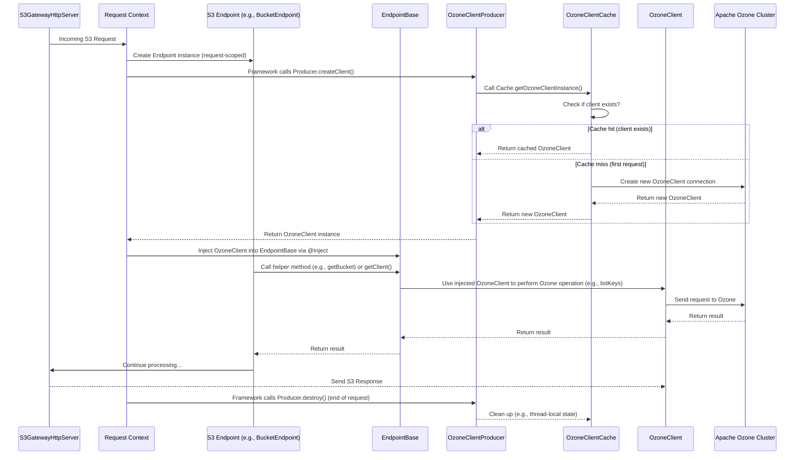

# Chapter 5: Ozone Client

Welcome back! In our journey through the `s3gateway` project, we've seen how it starts and listens for requests ([Chapter 1: Gateway and Servers](01_gateway_and_servers_.md)), how requests are initially processed ([Chapter 2: Request Processing Filters](02_request_processing_filters_.md)), how the client is identified ([Chapter 3: S3 Authentication and Authorization](03_s3_authentication_and_authorization_.md)), and *where* the logic for each S3 operation lives ([Chapter 4: S3 Endpoints](04_s3_endpoints_.md)).

Now, we arrive at a crucial piece: how do those S3 Endpoints actually *do* anything with the data? They need to interact with the backend storage system, which is Apache Ozone.

Imagine our service center again. The customer has been identified and is at the correct counter (Endpoint) for their request (e.g., "File Upload Counter"). But the counter staff don't magically handle the files themselves; they need to communicate with the building's internal storage facility – the pantry or warehouse (Apache Ozone).

The **Ozone Client** is the component that acts as this essential bridge. It's the specialized "staff member" at the counter who knows how to talk to the pantry, requesting ingredients (data to read) or sending items for storage (data to write).

The problem this concept solves is: **How does the S3 Gateway application, specifically the S3 Endpoints, communicate with the backend Apache Ozone cluster to perform storage operations like listing buckets, reading files, or writing files?**

The Ozone Client library provides a set of interfaces and classes that abstract away the complexities of talking directly to Ozone's services (like the Ozone Manager for metadata or the Storage Container Manager/DataNodes for data). The S3 Gateway uses this client library to make standard Ozone API calls, which the client then translates into the necessary network communication with the Ozone cluster.

## Key Players in Using the Ozone Client

Interacting with Ozone requires an instance of the `OzoneClient` class. However, creating and managing this client object efficiently for every single incoming S3 request is important. `s3gateway` uses a few components to handle this:

1.  **`OzoneClient`:** This is the main Java object you interact with to perform operations against Ozone. It's provided by the Apache Ozone client library itself, not `s3gateway`.
2.  **`OzoneClientCache`:** Think of this as a shared pool or factory for `OzoneClient` instances. Since establishing a connection to Ozone can be costly, it's efficient to reuse the same underlying client connection for multiple S3 requests. `OzoneClientCache` is responsible for creating this single, application-wide `OzoneClient` instance and making it available. It's like the main "pantry connection manager" for the whole service center.
3.  **`OzoneClientProducer`:** This component is used by the web framework (JAX-RS/CDI) to provide an `OzoneClient` instance to each *individual* S3 request's processing path. It gets the client from the `OzoneClientCache`. Although it might seem like a new client per request, the underlying connection comes from the shared cache. It's like each counter staff member gets their own "pantry access token" for their current customer, but they all use the *same* door to the pantry.
4.  **`EndpointBase`:** As we saw in the previous chapter, this is the base class for all S3 Endpoints. It's here that the `OzoneClient` instance (provided by `OzoneClientProducer`) is injected and made available via a getter method (`getClient()`) or helper methods (`getBucket()`, `getVolume()`).

## High-Level Flow: Getting the Ozone Client

Let's visualize how an S3 Endpoint gets its hands on an `OzoneClient` instance for a specific request:



This diagram shows how the request-scoped `OzoneClientProducer` is invoked by the framework for each request. It delegates the actual client creation/retrieval to the application-scoped `OzoneClientCache`, ensuring that the underlying connection is reused. This client is then injected into the endpoint base class, making it available for the endpoint logic to use.

## Obtaining Configuration: `OzoneConfigurationHolder`

Before an `OzoneClient` can be created, it needs configuration details (like where the Ozone Manager is located). The `s3gateway` application loads its configuration at startup ([Chapter 1: Gateway and Servers](01_gateway_and_servers_.md)) and makes it available via a simple holder class.

```java
// Simplified snippet from src/main/java/org/apache/hadoop/ozone/s3/OzoneConfigurationHolder.java
public final class OzoneConfigurationHolder {

  private static OzoneConfiguration configuration; // Holds the loaded config

  // ... setter and reset methods for testing ...

  @Produces // Tells the framework this method can produce an instance of OzoneConfiguration
  public static OzoneConfiguration configuration() {
    return configuration; // Return the held configuration
  }
}
```

This `OzoneConfigurationHolder` is straightforward. The static `configuration()` method, annotated with `@Produces`, allows the web framework to inject the loaded `OzoneConfiguration` wherever needed, including into the `OzoneClientProducer`.

## Managing the Shared Client: `OzoneClientCache`

The `OzoneClientCache` is responsible for holding the *single, shared* instance of the `OzoneClient` that talks to Ozone. It's annotated with `@ApplicationScoped`, meaning there is only one instance of this class for the entire running application.

```java
// Simplified snippet from src/main/java/org/apache/hadoop/ozone/s3/OzoneClientCache.java
@ApplicationScoped // Only one instance for the whole application
public final class OzoneClientCache {

  // The single, cached OzoneClient instance
  private static OzoneClientCache instance;
  private OzoneClient client;

  // Private constructor - client is created here
  private OzoneClientCache(OzoneConfiguration ozoneConfiguration) throws IOException {
    // ... security setup (e.g., getting certificates for TLS) ...
    try {
      // *** This is where the ACTUAL OzoneClient connection is made! ***
      // Depending on configuration (HA or not), it uses OzoneClientFactory
      String omServiceID = OmUtils.getOzoneManagerServiceId(ozoneConfiguration);
      if (omServiceID == null) {
        client = OzoneClientFactory.getRpcClient(ozoneConfiguration);
      } else {
        client = OzoneClientFactory.getRpcClient(omServiceID, ozoneConfiguration);
      }
    } catch (IOException e) {
      LOG.warn("cannot create OzoneClient", e);
      throw e;
    }
    // ... set S3 Auth check config ...
  }

  // Public static method to get the cached instance
  public static OzoneClient getOzoneClientInstance(OzoneConfiguration ozoneConfiguration)
      throws IOException {
    if (instance == null) {
      // If it's the first time, create the instance (which creates the client)
      instance = new OzoneClientCache(ozoneConfiguration);
    }
    return instance.client; // Return the cached client instance
  }

  @PreDestroy // Called when the application is shutting down
  public void destroy() throws IOException {
    OzoneClientCache.closeClient(); // Close the cached client
  }

  // ... closeClient helper method ...
  // ... setCertificate helper method (for TLS) ...
}
```

Key points here:
*   It's a `final class` with a `private constructor`, ensuring it can only be instantiated internally.
*   The `@ApplicationScoped` annotation guarantees it's a singleton in the CDI context.
*   The static `instance` variable holds the single instance.
*   `getOzoneClientInstance` is the public method used by others (`OzoneClientProducer`) to retrieve the client. It uses lazy initialization (`if (instance == null)`) to create the cache and client only when first needed.
*   The actual `OzoneClientFactory.getRpcClient` call in the constructor is where the connection to Ozone is established.
*   The `@PreDestroy` method ensures the underlying Ozone client connection is properly closed when the gateway application stops.

## Providing Client per Request: `OzoneClientProducer`

The `OzoneClientProducer` acts as the glue between the request-scoped endpoint instances and the application-scoped client cache. It's annotated with `@RequestScoped`, meaning a new instance is created for every incoming S3 request.

```java
// Simplified snippet from src/main/java/org/apache/hadoop/ozone/s3/OzoneClientProducer.java
@RequestScoped // A new instance for each incoming request
public class OzoneClientProducer {

  private OzoneClient client; // Will hold the client for THIS request

  @Inject // The framework injects the configuration here
  private OzoneConfiguration ozoneConfiguration;

  @Produces // This method tells the framework it can provide an OzoneClient
  public synchronized OzoneClient createClient() throws WebApplicationException, IOException {
    // ... set some config for S3 auth checks ...

    // *** Get the client instance from the cache ***
    client = getClient(ozoneConfiguration); // Calls the helper which calls OzoneClientCache
    return client; // Provide the client instance for injection into endpoints
  }

  @PreDestroy // Called when the request finishes
  public void destroy() throws IOException {
    // Clean up thread-local state set on the client proxy
    if (client != null && client.getObjectStore() != null && client.getObjectStore().getClientProxy() != null) {
        client.getObjectStore().getClientProxy().clearThreadLocalS3Auth();
    }
  }

  private OzoneClient getClient(OzoneConfiguration config) throws IOException {
    // Delegates to the static method in OzoneClientCache
    return OzoneClientCache.getOzoneClientInstance(config);
  }

  // ... setOzoneConfiguration method for testing ...
}
```

Here's what's happening:
*   `@RequestScoped` ensures a new `OzoneClientProducer` exists for each request.
*   `@Inject OzoneConfiguration` gets the application configuration.
*   The `@Produces` annotation on `createClient()` tells the JAX-RS/CDI framework: "Hey, whenever someone needs an `OzoneClient` for a request, call this method!"
*   `createClient()` calls the `getOzoneClientInstance` method on `OzoneClientCache` to get the (cached) client.
*   This client instance is then returned and injected by the framework into any class that requests it using `@Inject OzoneClient`, like our `EndpointBase`.
*   The `@PreDestroy` method is called when the request is finished. This is used here to clean up any thread-local state (like the S3 authentication details set in `EndpointBase`) on the client proxy, preventing information from leaking between requests.

## Using the Client in Endpoints: `EndpointBase`

Finally, the `EndpointBase` class, inherited by all specific S3 Endpoints, is where the injected `OzoneClient` is actually used to interact with Ozone.

```java
// Simplified snippet from src/main/java/org/apache/hadoop/ozone/s3/endpoint/EndpointBase.java
public abstract class EndpointBase implements Auditor {

  @Inject // The framework injects the client provided by OzoneClientProducer
  private OzoneClient client;

  // ... other injected dependencies ...

  @PostConstruct // Runs after the endpoint object is created and dependencies injected
  public void initialization() {
    // Set thread-local S3 authentication details on the client proxy
    s3Auth = new S3Auth(/* details from SignatureInfo */);
    ClientProtocol clientProtocol = getClient().getObjectStore().getClientProxy();
    clientProtocol.setThreadLocalS3Auth(s3Auth);
    clientProtocol.setIsS3Request(true);

    init(); // Abstract method for child classes to do their own setup
  }

  // Helper method to get a bucket using the injected client
  protected OzoneBucket getBucket(String bucketName)
      throws OS3Exception, IOException {
    try {
      // *** Use the injected client instance! ***
      return client.getObjectStore().getS3Bucket(bucketName);
    } catch (OMException ex) {
      // ... translate Ozone errors to S3 errors (Chapter 7) ...
      throw ex;
    }
  }

  // Helper method to get the raw Ozone Client protocol interface
  protected ClientProtocol getClientProtocol() {
    // *** Access the underlying client protocol via the injected client ***
    return getClient().getProxy();
  }

  // Public getter for the injected client (used internally or for testing)
  public OzoneClient getClient() {
    return client;
  }

  // ... other helper methods (createS3Bucket, listS3Buckets, etc. all use 'client') ...
}
```

Notice the `@Inject private OzoneClient client;`. This is where the client produced by `OzoneClientProducer` (which came from `OzoneClientCache`) is automatically provided to *each* new `EndpointBase` instance created for an incoming request.

The `@PostConstruct` method in `EndpointBase` is crucial. After the `OzoneClient` is injected, this method runs and sets thread-local information (like the S3 authentication details parsed by the filter in [Chapter 3: S3 Authentication and Authorization](03_s3_authentication_and_authorization_.md)) onto the `OzoneClient`'s proxy object. This allows the client library to associate the correct user context with subsequent calls to Ozone Manager and DataNodes for that specific request.

Helper methods like `getBucket` then simply call methods on the injected `client` object (`client.getObjectStore().getS3Bucket(...)`) to perform the desired actions against Ozone.

## Back to the Use Case

Let's revisit our use case from [Chapter 4: S3 Endpoints](04_s3_endpoints_.md): listing objects in a bucket (`GET /mybucket?prefix=data%2F`).

The `BucketEndpoint` class handles this (`@GET` method on `@Path("/{bucket}")`). Inside that method, after handling query parameters and security checks, it needs to get the list of keys from Ozone. It does this by calling a helper method, likely one using the injected `OzoneClient`:

```java
// Simplified snippet within BucketEndpoint.get() method
// ... after getting bucketName, prefix, etc. ...

OzoneBucket bucket = getBucket(bucketName); // Uses EndpointBase.getBucket which uses 'client'

// Use the injected OzoneClient object (accessed via 'bucket') to list keys
Iterator<? extends OzoneKey> ozoneKeyIterator =
    bucket.listKeys(prefix, /* startAfter */ null, /* shallow */ false);

// ... process the iterator and build the S3 response ...
```

Here, `bucket.listKeys(...)` is an Ozone Client API call. The `bucket` object itself was obtained using the `EndpointBase.getBucket()` helper, which in turn used the `@Inject`-ed `OzoneClient` instance that was provided for this specific request by `OzoneClientProducer` (which retrieved it from `OzoneClientCache`).

This chain of dependency injection and method calls is how the S3 Endpoint, living within the S3 Gateway application, successfully communicates with the backend Apache Ozone cluster.

## Conclusion

In this chapter, we unveiled the **Ozone Client** and the mechanisms surrounding it in `s3gateway`. We learned that the `OzoneClient` is the crucial interface used by S3 Endpoints to talk to the backend Ozone cluster. We explored how `OzoneClientCache` provides a single, cached client instance for efficiency, how `OzoneClientProducer` makes this client available per incoming request via dependency injection, and how the `EndpointBase` class injects and uses this client, including setting the necessary S3 authentication context for the request. This infrastructure allows the S3 Gateway to translate S3 API calls into the corresponding operations on Apache Ozone.

Now that we understand how data and metadata are requested from or sent to Ozone, we need to see how that data is formatted according to the S3 API specifications for responses sent back to the client. That's the topic of our next chapter.

[Chapter 6: S3 Data Formats and Marshalling](06_s3_data_formats_and_marshalling_.md)

---

Generated by [AI Codebase Knowledge Builder](https://github.com/The-Pocket/Tutorial-Codebase-Knowledge)