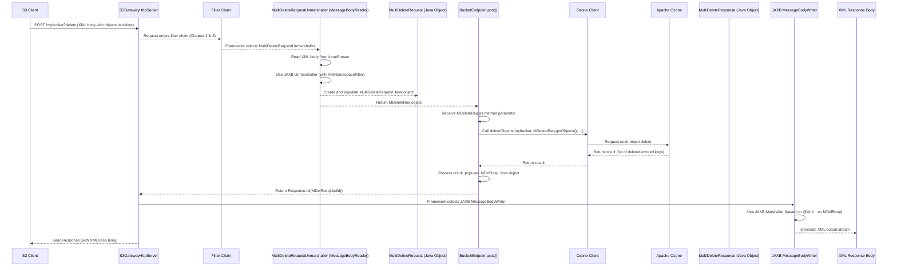

# Chapter 6: S3 Data Formats and Marshalling

Welcome back! In the previous chapters, we've built up our understanding of how the `s3gateway` starts ([Chapter 1: Gateway and Servers](01_gateway_and_servers_.md)), processes incoming requests through filters ([Chapter 2: Request Processing Filters](02_request_processing_filters_.md)), authenticates clients ([Chapter 3: S3 Authentication and Authorization](03_s3_authentication_and_authorization_.md)), identifies the specific S3 operation requested by routing to the right endpoint ([Chapter 4: S3 Endpoints](04_s3_endpoints_.md)), and how those endpoints talk to Apache Ozone ([Chapter 5: Ozone Client](05_ozone_client_.md)).

Now, let's think about the actual *data* being exchanged. S3 has a very specific way of structuring the information it sends and receives. When you ask S3 to list your objects, it sends back a carefully formatted XML document. When you tell S3 which objects to delete in a batch, you send a specific XML structure in the request body.

Imagine you're ordering food at our service center. The menu ([S3 API reference](https://docs.aws.amazon.com/AmazonS3/latest/API/API_Operations.html)) lists all the possible dishes (operations) and describes exactly what ingredients are needed for each order (request format) and how the final meal will be presented on the plate (response format). The kitchen staff (our S3 Endpoints interacting with the Ozone Client) work with raw ingredients, but they need to package them up according to the menu's presentation rules before serving them to the customer.

The problem this concept solves is: **How does `s3gateway` understand the specific structure of data in S3 requests and responses, and how does it convert between Java objects (which the gateway code uses internally) and the XML format required by the S3 API?**

This conversion process is called **marshalling** (Java object -> XML) and **unmarshalling** (XML -> Java object). `s3gateway` uses standard Java libraries and annotations, primarily JAXB (Java Architecture for XML Binding), to handle this.

## What are S3 Data Format Classes?

At the heart of this concept are plain old Java objects (POJOs) that are designed to perfectly mirror the structure of the XML data used in S3 API calls.

For example, if an S3 client asks to list objects in a bucket (`GET /<bucket-name>`), the S3 API specifies that the response must be an XML document structured like this:

```xml
<ListBucketResult xmlns="http://s3.amazonaws.com/doc/2006-03-01/">
  <Name>mybucket</Name>
  <Prefix>data/</Prefix>
  <Marker/>
  <MaxKeys>1000</MaxKeys>
  <IsTruncated>false</IsTruncated>
  <Contents>
    <Key>data/file1.txt</Key>
    <LastModified>2023-10-26T10:00:00.000Z</LastModified>
    <ETag>"etag1"</ETag>
    <Size>1024</Size>
    <Owner>...</Owner>
    <StorageClass>STANDARD</StorageClass>
  </Contents>
  <Contents>
    <Key>data/file2.txt</Key>
    <LastModified>2023-10-26T10:05:00.000Z</LastModified>
    <ETag>"etag2"</ETag>
    <Size>2048</Size>
    <Owner>...</Owner>
    <StorageClass>STANDARD</StorageClass>
  </Contents>
  <CommonPrefixes>
      <Prefix>folder1/</Prefix>
  </CommonPrefixes>
</ListBucketResult>
```

To represent this structure in Java, `s3gateway` defines classes like `ListObjectResponse`, `KeyMetadata`, and `CommonPrefix`.

Here's a simplified look at how the `ListObjectResponse` and `KeyMetadata` classes correspond to the XML:

```java
// Simplified snippet from src/main/java/org/apache/hadoop/ozone/s3/endpoint/ListObjectResponse.java
// This class represents the overall <ListBucketResult>
@XmlAccessorType(XmlAccessType.FIELD) // Tells JAXB to look at fields directly
@XmlRootElement(name = "ListBucketResult", namespace = S3Consts.S3_XML_NAMESPACE) // Maps class to XML root element
public class ListObjectResponse {

  @XmlElement(name = "Name") // Maps field to <Name> element
  private String name;

  @XmlElement(name = "Prefix") // Maps field to <Prefix> element
  private EncodingTypeObject prefix; // Custom type for encoding

  // ... other fields like Marker, MaxKeys, IsTruncated ...

  @XmlElement(name = "Contents") // Maps List field to multiple <Contents> elements
  private List<KeyMetadata> contents = new ArrayList<>();

  @XmlElement(name = "CommonPrefixes") // Maps List field to multiple <CommonPrefixes> elements
  private List<CommonPrefix> commonPrefixes = new ArrayList<>();

  // ... getters and setters ...

  public void addKey(KeyMetadata keyMetadata) {
    contents.add(keyMetadata);
  }

  public void addPrefix(EncodingTypeObject relativeKeyName) {
    commonPrefixes.add(new CommonPrefix(relativeKeyName));
  }
}
```

```java
// Simplified snippet from src/main/java/org/apache/hadoop/ozone/s3/commontypes/KeyMetadata.java
// This class represents a single <Contents> element
@XmlAccessorType(XmlAccessType.FIELD) // Tells JAXB to look at fields directly
public class KeyMetadata {

  @XmlJavaTypeAdapter(ObjectKeyNameAdapter.class) // Use a custom adapter for XML conversion
  @XmlElement(name = "Key") // Maps field to <Key> element
  private EncodingTypeObject key; // or the Object Name

  @XmlElement(name = "Owner") // Maps field to <Owner> element
  private S3Owner owner; // Another custom type

  @XmlJavaTypeAdapter(IsoDateAdapter.class) // Use custom adapter for date format
  @XmlElement(name = "LastModified") // Maps field to <LastModified> element
  private Instant lastModified;

  @XmlElement(name = OzoneConsts.ETAG) // Maps field to <ETag> element
  private String eTag;

  @XmlElement(name = "Size") // Maps field to <Size> element
  private long size;

  // ... other fields ...

  // ... getters and setters ...
}
```

Notice the `@Xml...` annotations. These are JAXB annotations:
*   `@XmlRootElement`: Marks the top-level element in the XML.
*   `@XmlElement`: Maps a Java field to an XML element with a specific name.
*   `@XmlAccessorType(XmlAccessType.FIELD)`: Tells JAXB to automatically map fields unless otherwise specified.
*   `@XmlJavaTypeAdapter`: Allows using custom code (`XmlAdapter` subclasses) to handle the conversion for specific data types (like `Instant` to S3 date string or `EncodingTypeObject` to the correct S3 key name format).

Similarly, for incoming requests that have XML bodies, like `MultiDeleteRequest` (sending a list of objects to delete) or `CompleteMultipartUploadRequest` (sending the list of uploaded parts), there are corresponding Java classes:

```java
// Simplified snippet from src/main/java/org/apache/hadoop/ozone/s3/endpoint/MultiDeleteRequest.java
// Represents the XML body for a multi-object delete request
@XmlAccessorType(XmlAccessType.FIELD)
@XmlRootElement(name = "Delete", namespace = S3Consts.S3_XML_NAMESPACE)
public class MultiDeleteRequest {

  @XmlElement(name = "Quiet")
  private Boolean quiet = Boolean.FALSE;

  @XmlElement(name = "Object") // Maps List field to multiple <Object> elements
  private List<DeleteObject> objects = new ArrayList<>();

  // ... getters and setters ...

  /**
   * JAXB entity for child element <Object>.
   */
  @XmlAccessorType(XmlAccessType.FIELD)
  @XmlRootElement(name = "Object", namespace = S3Consts.S3_XML_NAMESPACE)
  public static class DeleteObject { // Represents a single object to delete

    @XmlElement(name = "Key") // Maps field to <Key> element
    private String key;

    @XmlElement(name = "VersionId") // Maps field to <VersionId> element
    private String versionId;

    // ... constructors, getters, setters ...
  }
}
```

These classes provide a structured way for the `s3gateway` code to work with S3 data, abstracting away the complexities of parsing or generating XML directly.

## Marshalling: Java Object -> XML (For Responses)

Converting a Java object (like our populated `ListObjectResponse`) into the required S3 XML format is called marshalling. In `s3gateway`, this is handled *automatically* by the JAX-RS framework (Jersey), thanks to the JAXB annotations we just saw.

When an S3 Endpoint method (like the `get()` method in `BucketEndpoint` for listing objects) finishes its work, it typically returns a `javax.ws.rs.core.Response` object. If the response body (`Response.entity()`) is a Java object annotated with JAXB annotations, and the response's `Content-Type` is set to `application/xml`, the JAX-RS framework automatically finds a "MessageBodyWriter" (a component that knows how to write a Java object to an output stream).

A standard JAXB MessageBodyWriter uses the `@Xml...` annotations on the Java object to generate the corresponding XML output stream, which is then sent back to the S3 client as the response body.

**Endpoint Code Example (Marshalling):**

```java
// Simplified snippet from BucketEndpoint.get() method (listing objects)
// ... after fetching keys from Ozone and populating the response object ...

ListObjectResponse response = new ListObjectResponse();
response.setName(bucketName);
response.setPrefix(EncodingTypeObject.createNullable(prefix, "url"));
// ... populate response.contents and response.commonPrefixes ...
response.setMaxKeys(maxKeys);
response.setTruncated(isTruncated);
// ... set other fields ...

// The framework automatically marshals the 'response' object into XML!
return Response.ok(response).build(); // Build Response with the Java object as entity
```

In this example, the `BucketEndpoint` creates a `ListObjectResponse` Java object, populates it with data retrieved from Ozone, and then returns `Response.ok(response).build()`. The JAX-RS framework sees that `response` is the entity and has `@XmlRootElement` and other JAXB annotations, and its `Content-Type` will be set to XML (often implicitly by JAX-RS based on method `@Produces` or configuration). It then uses JAXB to marshal the `ListObjectResponse` object into the XML string needed by the S3 client. The endpoint code itself doesn't need to write XML manually.

## Unmarshalling: XML -> Java Object (For Requests)

Converting incoming XML from an S3 request body (like the list of objects to delete in a `MultiDeleteRequest`) into a Java object is called unmarshalling. For this, `s3gateway` needs specific components called `MessageBodyReader`s.

A `MessageBodyReader` is a JAX-RS component that knows how to read data from an incoming request's input stream and convert it into a specific Java type *before* it's passed as a parameter to the endpoint method.

`s3gateway` provides generic and specific unmarshallers:

1.  **`MessageUnmarshaller<T>`:** A generic base class that implements `MessageBodyReader<T>` for any class `T` that has JAXB annotations. It uses the standard JAXB `JAXBContext` and `Unmarshaller` to parse XML. It also includes an `XmlNamespaceFilter` to handle cases where the incoming XML might or might not include the expected S3 namespace (`http://s3.amazonaws.com/doc/2006-03-01/`).

    ```java
    // Simplified snippet from src/main/java/org/apache/hadoop/ozone/s3/endpoint/MessageUnmarshaller.java
    @Provider // Tells JAX-RS this is a provider (like a MessageBodyReader)
    // Note: This specific class doesn't have @Consumes, subclasses specify it
    public class MessageUnmarshaller<T> implements MessageBodyReader<T> {

      private final JAXBContext context; // JAXB context for marshalling/unmarshalling
      private final SAXParserFactory saxParserFactory; // For parsing XML
      private final Class<T> cls; // The target Java class (e.g., MultiDeleteRequest.class)

      public MessageUnmarshaller(Class<T> cls) {
        this.cls = cls;
        try {
          // Create JAXBContext for the target class
          context = JAXBContext.newInstance(cls);
          saxParserFactory = SAXParserFactory.newInstance();
          saxParserFactory.setFeature(XMLConstants.FEATURE_SECURE_PROCESSING, true);
        } catch (Exception ex) {
          throw new AssertionError("Can not instantiate XML parser for " + cls.getSimpleName(), ex);
        }
      }

      @Override
      public boolean isReadable(Class<?> aClass, Type type,
          Annotation[] annotations, MediaType mediaType) {
        // This reader can read if the target type matches its class and media type is XML
        return type.equals(cls) && mediaType.equals(MediaType.APPLICATION_XML_TYPE);
      }

      @Override
      public T readFrom(
          Class<T> aClass, Type type,
          Annotation[] annotations, MediaType mediaType,
          MultivaluedMap<String, String> multivaluedMap,
          InputStream inputStream // The incoming XML data stream
      ) throws WebApplicationException {
        try {
          XMLReader xmlReader = saxParserFactory.newSAXParser().getXMLReader();
          UnmarshallerHandler unmarshallerHandler =
              context.createUnmarshaller().getUnmarshallerHandler();
          // Apply the namespace filter
          XmlNamespaceFilter filter = new XmlNamespaceFilter(S3_XML_NAMESPACE);
          filter.setContentHandler(unmarshallerHandler);
          filter.setParent(xmlReader);
          // Parse the input stream
          filter.parse(new InputSource(inputStream));
          // Get the resulting Java object
          return cls.cast(unmarshallerHandler.getResult());
        } catch (Exception e) {
          // Wrap parsing errors into S3 exceptions (Chapter 7)
          throw wrapOS3Exception(INVALID_REQUEST.withMessage(e.getMessage()));
        }
      }
      // ... helper methods ...
    }
    ```

2.  **Specific Unmarshallers:** Subclasses like `MultiDeleteRequestUnmarshaller` simply extend `MessageUnmarshaller` and tell it which specific Java class they are for. They also often add the `@Provider` and `@Consumes(MediaType.APPLICATION_XML)` annotations so the JAX-RS framework knows to use them for incoming XML targeting their specific Java type.

    ```java
    // Simplified snippet from src/main/java/org/apache/hadoop/ozone/s3/endpoint/MultiDeleteRequestUnmarshaller.java
    @Provider // Register this with JAX-RS
    @Consumes(MediaType.APPLICATION_XML) // This reader handles incoming XML
    public class MultiDeleteRequestUnmarshaller
        extends MessageUnmarshaller<MultiDeleteRequest> { // It reads MultiDeleteRequest objects

      public MultiDeleteRequestUnmarshaller() {
        super(MultiDeleteRequest.class); // Tell the base class the target type
      }
    }
    ```
    Similarly, you'll find `CompleteMultipartUploadRequestUnmarshaller` and `PutBucketAclRequestUnmarshaller` extending `MessageUnmarshaller` for their respective types.

**Endpoint Code Example (Unmarshalling):**

```java
// Simplified snippet from BucketEndpoint.post() method (handling multi-delete)
/**
 * Rest endpoint for multi object delete.
 * Handled by POST /{bucket}?delete
 */
@POST // Handles POST requests
public Response post(@PathParam("bucket") String bucketName,
                     @QueryParam("delete") String deleteMarker, // Identifies multi-delete
                     MultiDeleteRequest multiDeleteRequest // *** This is the UNMARSHALLED object! ***
                     ) throws IOException, OS3Exception {

  long startNanos = Time.monotonicNowNanos();
  S3GAction s3GAction = S3GAction.DELETE_OBJECTS;

  try {
    // Because of the unmarshaller, the XML request body has already been
    // converted into the 'multiDeleteRequest' Java object by the framework!
    // We can just access its methods to get the list of objects to delete.
    List<MultiDeleteRequest.DeleteObject> objectsToDelete = multiDeleteRequest.getObjects();
    boolean quiet = multiDeleteRequest.isQuiet();

    // Now, call the internal method to perform the delete using the Java object
    MultiDeleteResponse response = multiDelete(bucketName, objectsToDelete, quiet);

    // Log success and return the response (which will be marshalled back to XML)
    AUDIT.logWriteSuccess(
        buildAuditMessageForSuccess(s3GAction, getAuditParameters()));
    return Response.ok(response).build();

  } catch (Exception ex) {
    // ... handle errors (Chapter 7) ...
    throw ex;
  }
}
```

Notice the method parameter `MultiDeleteRequest multiDeleteRequest`. Because `MultiDeleteRequestUnmarshaller` is registered as a `MessageBodyReader` for `MultiDeleteRequest` and `@Consumes(MediaType.APPLICATION_XML)`, the JAX-RS framework automatically reads the incoming XML request body, uses the unmarshaller to parse it into a `MultiDeleteRequest` Java object, and passes that object directly to the `post` method. The endpoint method receives the ready-to-use Java object and doesn't need to worry about parsing XML itself.

## Special Case: PlainTextMultipartUploadReader

Sometimes, S3 client tools don't strictly follow the API specs for certain requests. For instance, `aws s3 cp` might send a `text/plain` `Content-Type` for a multipart upload completion request, even though the body should be XML.

To handle this, `s3gateway` has a specific `PlainTextMultipartUploadReader`. This reader is annotated with `@Consumes("text/plain")` and indicates it can read into a `CompleteMultipartUploadRequest`. However, its `readFrom` method simply returns an *empty* `CompleteMultipartUploadRequest` object.

```java
// Simplified snippet from src/main/java/org/apache/hadoop/ozone/s3/endpoint/PlainTextMultipartUploadReader.java
@Provider // Register with JAX-RS
@Consumes("text/plain") // This reader handles text/plain requests
public class PlainTextMultipartUploadReader
    implements MessageBodyReader<CompleteMultipartUploadRequest> { // It reads CompleteMultipartUploadRequest

  @Override
  public boolean isReadable(Class<?> type, Type genericType,
      Annotation[] annotations, MediaType mediaType) {
    // This reader is applicable if the target type is CompleteMultipartUploadRequest
    // and the media type is text/plain
    return type.equals(CompleteMultipartUploadRequest.class)
        && mediaType.equals(MediaType.TEXT_PLAIN_TYPE);
  }

  @Override
  public CompleteMultipartUploadRequest readFrom(
      Class<CompleteMultipartUploadRequest> type, Type genericType,
      Annotation[] annotations, MediaType mediaType,
      MultivaluedMap<String, String> httpHeaders, InputStream entityStream)
      throws IOException, WebApplicationException {
    // For text/plain, just return an empty CompleteMultipartUploadRequest.
    // The actual completion details will likely come from query parameters or headers,
    // or this might signify a non-standard completion request.
    return new CompleteMultipartUploadRequest();
  }
}
```

This reader ensures that even malformed requests with `text/plain` `Content-Type` don't cause a parser error immediately, allowing the endpoint logic to potentially handle them based on other request details.

## Data Formats and Marshalling Flow

Let's visualize the process for a request that involves both unmarshalling (request body) and marshalling (response body), like the Multi-Delete request:



This diagram shows how the `MessageBodyReader` (the Unmarshaller) intercepts the request *before* the endpoint method is called, converting the XML body into a Java object that the endpoint receives as a parameter. After the endpoint processes the request and returns a Java object, the JAX-RS framework intercepts the response and uses a `MessageBodyWriter` (the JAXB Marshaller) to convert the Java object back into XML for the response body.

## Conclusion

In this chapter, we explored how `s3gateway` handles **S3 Data Formats and Marshalling**. We saw that specific Java classes, heavily annotated with JAXB (`@XmlRootElement`, `@XmlElement`, etc.), define the structure for S3 request and response XML data. We learned that the JAX-RS framework automatically handles **marshalling** (Java to XML for responses) using these annotations. For **unmarshalling** (XML to Java for requests), `s3gateway` uses `MessageBodyReader` implementations like `MessageUnmarshaller` and its subclasses, which parse the incoming XML into the corresponding Java objects before the endpoint methods are invoked. This clear separation of concerns allows endpoint logic to work primarily with Java objects, simplifying development and maintaining compatibility with the S3 API's XML formats.

Now that we know how data is formatted and exchanged, what happens when things go wrong? The S3 API has specific ways to report errors. That's the topic of our next chapter.

[Chapter 7: S3 Exception Handling](07_s3_exception_handling_.md)

---

Generated by [AI Codebase Knowledge Builder](https://github.com/The-Pocket/Tutorial-Codebase-Knowledge)