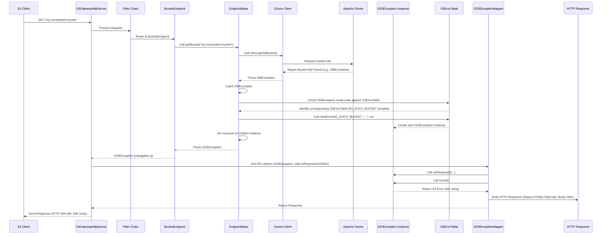

# Chapter 7: S3 Exception Handling

Welcome back! In our previous chapter, [Chapter 6: S3 Data Formats and Marshalling](06_s3_data_formats_and_marshalling_.md), we learned how `s3gateway` converts data between Java objects (used internally) and the XML format required by the S3 API for both requests and responses.

But what happens when something goes wrong during request processing? Perhaps the client requested a bucket that doesn't exist, tried to access a resource they don't have permission for, or sent a malformed request. Just like S3 expects data in a specific format, it also expects errors to be reported in a standard, predictable way.

Imagine our service center analogy again. Sometimes a customer has a problem – maybe the file they requested isn't in the storage (like a "file not found" error) or they don't have access rights to a specific account (like an "access denied" error). The service center needs a standard procedure for handling these complaints. They can't just shrug and say "oops!". They need to formally acknowledge the issue, categorize it (e.g., "Item Not Found"), provide details ("The file 'report.txt' was not found"), and explain *why* (e.g., "It might have been deleted or never existed"). This response also needs to be delivered consistently, perhaps on a standard "Incident Report" form.

The problem this concept solves is: **How does `s3gateway` translate internal errors or specific S3-related problems into the standard XML error response format that S3 clients expect, including the correct S3 error code, message, and HTTP status code?**

This is the role of **S3 Exception Handling**. It ensures that when an error occurs that is relevant to the S3 API, it's caught and transformed into a response that looks exactly like an error from a real S3 service, rather than a generic web server error.

## Key Players in S3 Exception Handling

`s3gateway` manages S3 errors using a few key components:

1.  **`OS3Exception`:** This is the special type of Java exception used specifically for S3-related errors. It's designed to hold all the pieces of information required for a standard S3 error response (like the S3 error Code, a human-readable Message, the Resource the error occurred on, a unique RequestId, and the corresponding HTTP status code).
2.  **`S3ErrorTable`:** This class is like a catalog of standard, predefined S3 errors. Instead of creating `OS3Exception` objects from scratch every time, the code uses templates from `S3ErrorTable` for common S3 issues (like `NO_SUCH_BUCKET`, `ACCESS_DENIED`, `INTERNAL_ERROR`).
3.  **`OS3ExceptionMapper`:** This is a special component (a JAX-RS `ExceptionMapper`) that acts as a central error handler. Whenever an `OS3Exception` is thrown anywhere in the request processing pipeline (in a filter, an endpoint, or even deep within the Ozone Client interaction), the framework catches it and passes it to this mapper. The mapper's job is to turn the `OS3Exception` object into the final HTTP response that gets sent back to the client.

## Use Case: Accessing a Non-existent Bucket

Let's trace what happens when an S3 client tries to list objects in a bucket that doesn't exist, like `GET /my-nonexistent-bucket`.

1.  The request `GET /my-nonexistent-bucket` arrives at the `S3GatewayHttpServer` (Chapter 1).
2.  It passes through the request processing filters (Chapters 2, 3), which perform tasks like virtual host style conversion, authentication, etc.
3.  The JAX-RS framework routes the request to the appropriate endpoint, which is the `BucketEndpoint` (Chapter 4), because the request is about a specific bucket (`/{bucket}`).
4.  Inside the `BucketEndpoint`, the `@GET` method is called to handle the list objects operation. This method needs to get information *about* the bucket from Ozone. It will call a helper method, likely `EndpointBase.getBucket("my-nonexistent-bucket")` (Chapter 5).
5.  The `EndpointBase.getBucket()` method uses the injected `OzoneClient` (Chapter 5) to call the backend Ozone Manager and ask for details about "my-nonexistent-bucket".
6.  The Ozone Manager reports back to the `OzoneClient` that this bucket does not exist. The `OzoneClient` translates this into an Ozone-specific error, like an `OMException` with a specific result code indicating "bucket not found".
7.  The `EndpointBase.getBucket()` method catches this `OMException`.
8.  It recognizes the `OMException`'s result code corresponds to an S3 "NoSuchBucket" error. It uses the `S3ErrorTable` to find the standard `NoSuchBucket` error template and creates a new `OS3Exception` instance based on it. It sets the resource field to "my-nonexistent-bucket".
9.  The `EndpointBase.getBucket()` method *throws* this newly created `OS3Exception`.
10. The `BucketEndpoint` method that called `getBucket()` might catch certain exceptions, but it's designed to let `OS3Exception`s pass through or re-throw them.
11. The JAX-RS framework runtime, seeing that an `OS3Exception` has been thrown and not caught within the endpoint method's normal execution path, intercepts it.
12. The framework looks for a registered `ExceptionMapper` that can handle `OS3Exception`. It finds the `OS3ExceptionMapper`.
13. The framework calls the `OS3ExceptionMapper.toResponse()` method, passing the thrown `OS3Exception` instance.
14. The `OS3ExceptionMapper` uses the details from the `OS3Exception` (HTTP status, error code, message, resource) to build the final HTTP response. It adds the `RequestId` using a helper. It calls `exception.toXml()` to get the XML error body.
15. The `OS3ExceptionMapper` returns a `javax.ws.rs.core.Response` object with the correct HTTP status code (e.g., 404 Not Found) and the XML body.
16. The `S3GatewayHttpServer` sends this `Response` back to the S3 client.

The S3 client receives an HTTP 404 Not Found response with an XML body that looks like this:

```xml
<?xml version="1.0" encoding="UTF-8"?>
<Error>
  <Code>NoSuchBucket</Code>
  <Message>The specified bucket does not exist</Message>
  <Resource>/my-nonexistent-bucket</Resource>
  <RequestId>...</RequestId>
</Error>
```

This is the standard S3 way of reporting this error, and the client understands it.

## Looking at the Code

Let's examine the key code components involved in this process.

### `OS3Exception`: The S3 Error Object

This is the custom exception class used to carry S3 error information.

```java
// Simplified snippet from src/main/java/org/apache/hadoop/ozone/s3/exception/OS3Exception.java
@XmlRootElement(name = "Error") // This is the root element name in the XML
@XmlAccessorType(XmlAccessType.NONE) // Only fields with @XmlElement are mapped
public class OS3Exception extends Exception {

  @XmlElement(name = "Code")      // Maps field to <Code> element
  private String code;

  @XmlElement(name = "Message")   // Maps field to <Message> element
  private String errorMessage;

  @XmlElement(name = "Resource")  // Maps field to <Resource> element
  private String resource;

  @XmlElement(name = "RequestId") // Maps field to <RequestId> element
  private String requestId;

  @XmlTransient // This field is NOT included in the XML output
  private int httpCode;

  // Constructor to create an exception with code, message, and HTTP code
  public OS3Exception(String codeVal, String messageVal, int httpCode) {
    this.code = codeVal;
    this.errorMessage = messageVal;
    this.httpCode = httpCode;
  }

  // Getters for all fields...
  public String getCode() { return code; }
  public String getErrorMessage() { return errorMessage; }
  public String getResource() { return resource; }
  public String getRequestId() { return requestId; }
  public int getHttpCode() { return httpCode; }

  // Setter for RequestId (typically set by the mapper)
  public void setRequestId(String requestId) { this.requestId = requestId; }
  // Setter for Resource (typically set when creating the exception)
  public void setResource(String resource) { this.resource = resource; }

  // Method to convert the exception object to S3 error XML
  public String toXml() {
    try {
      // Uses an XML mapper (Jackson with JAXB annotations) to generate XML
      String val = mapper.writeValueAsString(this);
      // Adds the XML declaration header
      return "<?xml version=\"1.0\" encoding=\"UTF-8\"?>\n" + val;
    } catch (Exception ex) {
      // Fallback to manual formatting if XML mapping fails
      return String.format("<?xml version=\"1.0\" encoding=\"UTF-8\"?>" +
          "<Error><Code>%s</Code><Message>%s</Message>" +
          "<Resource>%s</Resource><RequestId>%s</RequestId></Error>",
          this.getCode(), this.getErrorMessage(), this.getResource(),
          this.getRequestId());
    }
  }

  // ... other constructors and helper methods ...
}
```

This code shows that `OS3Exception` extends `Exception` (so it can be thrown), uses JAXB annotations (`@XmlRootElement`, `@XmlElement`, `@XmlTransient`) to define how it maps to the S3 error XML structure, and has fields to store the required S3 error details. The `toXml()` method is crucial; it uses an XML marshaller (like the one discussed in Chapter 6) to convert the object's state into the expected S3 XML format. The `httpCode` is marked `@XmlTransient` because it's used for the HTTP response status, not included in the XML body itself.

### `S3ErrorTable`: Predefined Error Templates

This class provides static instances of `OS3Exception` for common errors. This promotes consistency – every time a "NoSuchBucket" error needs to be reported, the code uses the same template from `S3ErrorTable`.

```java
// Simplified snippet from src/main/java/org/apache/hadoop/ozone/s3/exception/S3ErrorTable.java
public final class S3ErrorTable {

  // Static final instances for common errors
  public static final OS3Exception INVALID_URI = new OS3Exception("InvalidURI",
      "Couldn't parse the specified URI.", HTTP_BAD_REQUEST); // HTTP_BAD_REQUEST = 400

  public static final OS3Exception NO_SUCH_BUCKET = new OS3Exception(
      "NoSuchBucket", "The specified bucket does not exist", HTTP_NOT_FOUND); // HTTP_NOT_FOUND = 404

  public static final OS3Exception MALFORMED_HEADER = new OS3Exception(
      "AuthorizationHeaderMalformed", "The authorization header you provided " +
      "is invalid.", HTTP_BAD_REQUEST);

  public static final OS3Exception NO_SUCH_KEY = new OS3Exception(
      "NoSuchKey", "The specified key does not exist", HTTP_NOT_FOUND);

  public static final OS3Exception ACCESS_DENIED = new OS3Exception(
      "AccessDenied", "User doesn't have the right to access this " +
      "resource.", HTTP_FORBIDDEN); // HTTP_FORBIDDEN = 403

  public static final OS3Exception INTERNAL_ERROR = new OS3Exception(
      "InternalError", "We encountered an internal error. Please try again.",
      HTTP_INTERNAL_ERROR); // HTTP_INTERNAL_ERROR = 500

  // ... many other predefined errors ...

  private S3ErrorTable() {
    // Private constructor to prevent instantiation
  }

  /**
   * Create a new instance of Error based on a template.
   * @param e Error Template from S3ErrorTable (like S3ErrorTable.NO_SUCH_BUCKET)
   * @param resource Resource associated with this exception (e.g., bucket name)
   * @param ex The original cause (e.g., an OMException), may be null.
   * @return creates a new instance of OS3Exception
   */
  public static OS3Exception newError(OS3Exception e, String resource,
      Exception ex) {
    // Create a *new* OS3Exception copying template values
    OS3Exception err =  new OS3Exception(e.getCode(), e.getErrorMessage(),
        e.getHttpCode());
    err.setResource(resource); // Set the specific resource
    // RequestId is set later by the mapper
    // Logging the error details (useful for debugging)
    // ... logging logic based on HTTP code or debug level ...
    return err;
  }

  // ... helper to get a generic internal error ...
}
```

This class is simple but powerful. It holds constant `OS3Exception` objects which serve as templates. The `newError()` method is used throughout the code to create a *copy* of a template and fill in context-specific details like the `resource` name. This ensures the core S3 error code and message are consistent across the application.

### `OS3ExceptionMapper`: The Response Generator

This class is where the magic happens – it converts a thrown `OS3Exception` into an HTTP `Response`. It's a JAX-RS `Provider` and `ExceptionMapper`, meaning the framework knows to call its `toResponse` method when an `OS3Exception` is thrown.

```java
// Simplified snippet from src/main/java/org/apache/hadoop/ozone/s3/exception/OS3ExceptionMapper.java
@Provider // Tells JAX-RS to register this class
public class OS3ExceptionMapper implements ExceptionMapper<OS3Exception> {

  @Inject // Inject the RequestIdentifier to get the unique request ID
  private RequestIdentifier requestIdentifier;

  @Override
  public Response toResponse(OS3Exception exception) {
    // This method is called by the framework when an OS3Exception is thrown.

    // Log the exception (optional, but good for debugging)
    // ... logging logic ...

    // Set the RequestId on the exception object before generating XML
    exception.setRequestId(requestIdentifier.getRequestId());

    // Build the HTTP Response:
    // - Status code is taken from the exception's httpCode
    // - Entity (body) is the XML generated by exception.toXml()
    return Response.status(exception.getHttpCode())
        .entity(exception.toXml()).build();
  }
}
```

This is a very clean implementation. The JAX-RS framework calls `toResponse`, providing the `OS3Exception`. The mapper gets the unique request ID (which was set up earlier in the filter chain, likely Chapter 2/3), sets it on the exception object, and then uses the exception's HTTP code for the response status and its `toXml()` method for the response body. This guarantees that *every* `OS3Exception` thrown anywhere in the pipeline results in a correctly formatted S3 error response.

### Endpoint Integration

Let's quickly look back at how the `EndpointBase.getBucket` method uses `S3ErrorTable` and causes an `OS3Exception` to be thrown:

```java
// Simplified snippet from src/main/java/org/apache/hadoop/ozone/s3/endpoint/EndpointBase.java
// Helper method to get a bucket, handling common errors
protected OzoneBucket getBucket(String bucketName)
    throws OS3Exception, IOException { // Declare that it might throw OS3Exception
  try {
    // Interact with the Ozone Client! (Chapter 5)
    return client.getObjectStore().getS3Bucket(bucketName);
  } catch (OMException ex) {
    // Caught an Ozone error
    // Translate Ozone errors to S3 errors (this chapter!)
    if (ex.getResult() == ResultCodes.BUCKET_NOT_FOUND) {
      // Found a BUCKET_NOT_FOUND error code from Ozone
      // Use S3ErrorTable to create and THROW a NoSuchBucket OS3Exception
      throw newError(S3ErrorTable.NO_SUCH_BUCKET, bucketName, ex);
    }
    // ... handle other common Ozone errors and map them to S3 errors ...
    // If it's an unknown OMException, wrap it in a generic S3 InternalError
    throw newError(S3ErrorTable.INTERNAL_ERROR, bucketName, ex);
  }
  // ... other catch blocks for different exception types ...
}

// Helper method from EndpointBase to create an OS3Exception (calls S3ErrorTable.newError)
protected OS3Exception newError(OS3Exception e, String resource, Exception ex) {
    return S3ErrorTable.newError(e, resource, ex);
}
```

This snippet clearly shows the pattern: catch a lower-level exception (like `OMException` from Ozone), check its details (like `getResult()`), and if it maps to a known S3 error, use `S3ErrorTable.newError` to create the specific `OS3Exception` and `throw` it. The JAX-RS framework and the `OS3ExceptionMapper` take care of it from there.

There is also a `BadRequestExceptionMapper` in the code base. Its purpose is similar, but it catches the standard JAX-RS `BadRequestException` and maps it to a generic `400 Bad Request` response. This ensures that even if the JAX-RS framework itself throws a `BadRequestException` (e.g., due to invalid request format before our code even runs), it's handled gracefully, although it doesn't produce the full S3 XML error body by default in the provided snippet. The pattern is the same: use a mapper to intercept an exception and turn it into a `Response`.

## S3 Exception Handling Flow

Let's refine our sequence diagram for the "NoSuchBucket" use case, focusing on the exception flow:



This diagram clearly shows how the `OS3Exception` is created and thrown when an error is detected, and how the `OS3ExceptionMapper` is automatically invoked by the framework to turn that exception into the final, standardized S3 error response sent back to the client.

## Conclusion

In this chapter, we learned how `s3gateway` handles **S3 Exception Handling** to ensure that errors are reported to S3 clients in the standard XML format they expect. We explored the role of the `OS3Exception` class for representing S3-specific errors, the `S3ErrorTable` for providing predefined error templates, and the `OS3ExceptionMapper` for converting thrown `OS3Exception`s into the final HTTP responses with the correct status codes and XML bodies. This mechanism provides a consistent and S3-compliant way of communicating errors that occur during request processing.

Now that we understand how the gateway handles requests, interacts with Ozone, formats data, and reports errors, we'll look at some general helper code and utilities that are used throughout the project in the next chapter.

[Chapter 8: S3 Utilities](08_s3_utilities_.md)

---

Generated by [AI Codebase Knowledge Builder](https://github.com/The-Pocket/Tutorial-Codebase-Knowledge)