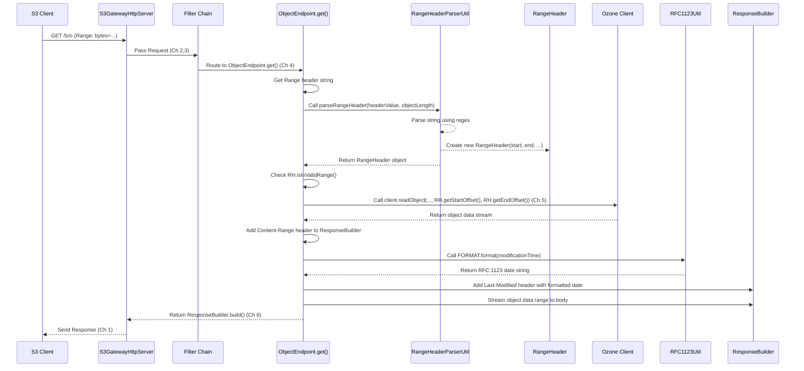

# Chapter 8: S3 Utilities

Welcome back! In the previous chapters, we've dissected the core components of the `s3gateway`: how it starts up ([Chapter 1: Gateway and Servers](01_gateway_and_servers_.md)), the initial processing steps requests go through ([Chapter 2: Request Processing Filters](02_request_processing_filters_.md)), how clients are authenticated ([Chapter 3: S3 Authentication and Authorization](03_s3_authentication_and_authorization_.md)), where the logic for S3 operations lives ([Chapter 4: S3 Endpoints](04_s3_endpoints_.md)), how those endpoints talk to Ozone ([Chapter 5: Ozone Client](05_ozone_client_.md)), how data is formatted for S3 ([Chapter 6: S3 Data Formats and Marshalling](06_s3_data_formats_and_marshalling_.md)), and how errors are reported ([Chapter 7: S3 Exception Handling](07_s3_exception_handling_.md)).

As we explored these different areas, you might have noticed that certain common tasks or pieces of information were needed repeatedly. For example, multiple parts of the code might need to format a date in a specific way, or decode a URL-encoded path, or figure out how to parse a complex header.

Imagine our service center kitchen again. While different chefs (Endpoints) handle different dishes (S3 operations), they all need access to basic ingredients (salt, pepper, sugar), common tools (knives, spatulas), and standard procedures (how to wash hands, how to label leftovers).

The problem this concept solves is: **How can we provide common, reusable functions and data structures that are needed across various parts of the `s3gateway` application, preventing code duplication and keeping the main logic clean?**

This is the role of **S3 Utilities**. These are helper classes and standalone functions that provide general utility features used by different filters, endpoints, and other components within the S3 Gateway. They are like the standard tools and common ingredients available in the kitchen for anyone to use.

Some examples of these utilities include:

*   `S3Utils`: General helpers like URL encoding/decoding, and mapping S3 storage types to Ozone replication.
*   `RFC1123Util`: For formatting dates in the specific RFC 1123 format required by many HTTP and S3 headers.
*   `RangeHeaderParserUtil` and `RangeHeader`: For parsing the `Range` header used to request only a portion of an object.
*   `ContinueToken`: A special utility used for pagination in listing operations (like listing keys in a bucket).
*   `AuditUtils`: Helpers for preparing parameters to be included in audit logs.
*   `S3Consts`: A simple class holding various constant strings used throughout the S3 code (header names, namespace URIs, etc.).

Let's look at how some of these utilities are used in practice, focusing on a simple use case: **Handling a GET Object request that asks for a specific byte range.**

## Use Case: Getting a Byte Range of an Object

Suppose an S3 client wants to download only the first 1000 bytes of an object named `my-large-file` in the bucket `mybucket`. The request would look something like `GET /mybucket/my-large-file` with an additional HTTP header: `Range: bytes=0-999`.

The `ObjectEndpoint` (Chapter 4) is responsible for handling this `GET` request. When it receives the request, it needs to:

1.  Identify that a `Range` header is present.
2.  Parse the value of the `Range` header (`bytes=0-999`) to extract the start and end byte offsets (0 and 999).
3.  Instruct the Ozone Client (Chapter 5) to read only this specific byte range from the object.
4.  Format the response headers correctly, including `Content-Range` to indicate which part of the object is being returned, and `Last-Modified` with the object's modification date formatted correctly.
5.  Stream the requested byte range back to the client.

Let's see how utilities help with steps 2 and 4.

## Parsing the Range Header: `RangeHeaderParserUtil` and `RangeHeader`

When the `ObjectEndpoint` is processing the `GET` request for an object, it checks for the `Range` header. If present, it calls `RangeHeaderParserUtil.parseRangeHeader()` to understand the requested range.

```java
// Simplified snippet from ObjectEndpoint.get()
// ... inside the @GET method ...

// Get the Range header string from the request
String rangeHeaderString = headers.getHeaderString(S3Consts.RANGE_HEADER);

RangeHeader rangeHeader = null;
if (rangeHeaderString != null) {
  // Use the utility to parse the header string
  // We also need the object's total length to handle relative ranges (like bytes=-500)
  long objectLength = keyDetails.getDataSize(); // Assume keyDetails holds object info
  rangeHeader = RangeHeaderParserUtil.parseRangeHeader(rangeHeaderString, objectLength);

  // Check if the parsed range is valid (e.g., range start is within object bounds)
  if (rangeHeader.isInValidRange()) {
     // If invalid, throw an S3 error (Chapter 7)
     throw newError(S3ErrorTable.INVALID_RANGE);
  }
}

// Now use the parsed rangeHeader object to decide how to read from Ozone
if (rangeHeader != null && !rangeHeader.isReadFull()) {
  // Read only a partial range
  long start = rangeHeader.getStartOffset();
  long end = rangeHeader.getEndOffset();
  long lengthToRead = end - start + 1;

  // Instruct Ozone client to read the specific range
  try (OzoneInputStream ozoneInputStream = keyDetails.getContent()) {
     ozoneInputStream.seek(start); // Seek to the start offset
     // ... copy 'lengthToRead' bytes from ozoneInputStream to response output stream ...
  }

  // Set Content-Range header in the response
  String contentRange = S3Consts.RANGE_HEADER_SUPPORTED_UNIT + " "
                      + start + "-" + end + "/" + objectLength;
  responseBuilder.header(S3Consts.CONTENT_RANGE_HEADER, contentRange);
  responseBuilder.status(S3Consts.RANGE_NOT_SATISFIABLE); // Or Partial Content (206)
  // ... build response ...

} else {
  // Read the full object
  // ... (existing logic for full object read) ...
}

// ... add other response headers like Last-Modified (using RFC1123Util below) ...

return responseBuilder.build();
```

The `RangeHeaderParserUtil` takes the header string and the object's total size and returns a `RangeHeader` object. This object is a simple data structure containing the `startOffset`, `endOffset`, and some boolean flags (`isReadFull`, `isInValidRange`) that the endpoint can easily check.

Let's look at the simple `RangeHeader` class:

```java
// Simplified snippet from src/main/java/org/apache/hadoop/ozone/s3/util/RangeHeader.java
/**
 * Ranger Header class which hold startoffset, endoffset of the Range header.
 */
public class RangeHeader {
  private long startOffset;
  private long endOffset;
  private boolean readFull;
  private boolean inValidRange;

  // Constructor
  public RangeHeader(long startOffset, long endOffset, boolean full,
                     boolean invalid) {
    this.startOffset = startOffset;
    this.endOffset = endOffset;
    this.readFull = full;
    this.inValidRange = invalid;
  }

  // Getters for the fields
  public long getStartOffset() { return startOffset; }
  public long getEndOffset() { return endOffset; }
  public boolean isReadFull() { return readFull; }
  public boolean isInValidRange() { return inValidRange; }

  // ... toString method ...
}
```

The `RangeHeaderParserUtil` contains the logic to parse the `bytes=X-Y` format, handling cases like missing start or end values. It uses a regular expression for this.

```java
// Simplified snippet from src/main/java/org/apache/hadoop/ozone/s3/util/RangeHeaderParserUtil.java
/**
 * Utility class for S3 Range Header parsing.
 */
public final class RangeHeaderParserUtil {

  // Regex pattern to match bytes=X-Y format
  // Matches "bytes=" followed by optional digits (start),
  // hyphen "-", and optional digits (end). Uses named capture groups.
  public static final Pattern RANGE_HEADER_MATCH_PATTERN =
      Pattern.compile("bytes=(?<start>[0-9]*)-(?<end>[0-9]*)");

  /**
   * Parse the rangeHeader and set the start and end offset.
   * @param rangeHeaderVal The value of the Range header (e.g., "bytes=0-999")
   * @param length The total length of the object
   * @return RangeHeader object with parsed offsets and flags
   */
  public static RangeHeader parseRangeHeader(String rangeHeaderVal, long
      length) {
    // ... logic to match the pattern ...
    Matcher matcher = RANGE_HEADER_MATCH_PATTERN.matcher(rangeHeaderVal);
    if (matcher.matches()) {
      // Extract start and end using named groups
      // Handle empty strings (e.g., "bytes=-500" or "bytes=100-")
      // Calculate actual offsets based on object length
      // Determine readFull and inValidRange flags
      // ...
    } else {
      // If header format is completely invalid, treat as full read but mark invalid
      // ...
    }
    // Return new RangeHeader(start, end, readFull, inValidRange);
    return new RangeHeader(0, length - 1, true, false); // Simplified return
  }

  // ... private constructor ...
}
```

This utility encapsulates the specific and potentially tricky logic of parsing the `Range` header, providing a clean `RangeHeader` object for the endpoint to use, keeping the endpoint's main code focused on interacting with Ozone.

## Formatting Dates: `RFC1123Util`

S3 requires certain date/time values in headers (like `Last-Modified`, `Date`) to be formatted according to RFC 1123. This is a specific format like `Tue, 03 Nov 2023 10:30:00 GMT`. Manually formatting dates into this exact string format can be error-prone.

The `RFC1123Util` provides a pre-configured `DateTimeFormatter` for this specific format.

```java
// Simplified snippet from ObjectEndpoint.get() or EndpointBase
// Method to add Last-Modified header
protected void addLastModifiedDate(ResponseBuilder responseBuilder,
                                   OzoneKeyDetails keyDetails) {
  // keyDetails.getModificationTime() returns an Instant (Java time object)
  Instant modificationTime = keyDetails.getModificationTime();
  if (modificationTime != null) {
    // Convert Instant to ZonedDateTime in GMT
    ZonedDateTime zdt = ZonedDateTime.ofInstant(modificationTime, ZoneOffset.UTC);
    // Use the formatter from RFC1123Util to format the date
    String lastModifiedString = RFC1123Util.FORMAT.format(zdt);
    // Add the formatted date string to the response header
    responseBuilder.header(HttpHeaders.LAST_MODIFIED, lastModifiedString);
  }
}

// ... in ObjectEndpoint.get(), after creating responseBuilder ...
// addLastModifiedDate(responseBuilder, keyDetails);
```

By using `RFC1123Util.FORMAT.format(zdt)`, the endpoint ensures the date is formatted correctly for the S3 client, without needing to know the intricate details of the RFC 1123 pattern.

The `RFC1123Util` class itself simply defines this formatter:

```java
// Simplified snippet from src/main/java/org/apache/hadoop/ozone/s3/util/RFC1123Util.java
/**
 * Stricter RFC1123 data format.
 * ... always use two digits for the days ...
 */
public final class RFC1123Util {
  /**
   * An RFC-1123 compatible file format which always use two digits for the
   * days.
   */
  public static final DateTimeFormatter FORMAT;

  static {
    // This block builds the DateTimeFormatter using a builder,
    // specifying the exact pattern components (Day of week, day of month,
    // month name, year, hour, minute, second, timezone offset).
    // It includes custom mappings for day/month names and ensures two digits
    // for day of month.
    FORMAT = new DateTimeFormatterBuilder()
        // ... pattern building details ...
        .toFormatter(); // Finalize the formatter
  }

  private RFC1123Util() {
  }
}
```
This static `FORMAT` is thread-safe and can be reused by any part of the application needing RFC 1123 date formatting.

## Other General Helpers: `S3Utils`

`S3Utils` is a collection of miscellaneous helpers. One common need in web services is handling URL encoding and decoding, especially for object keys that might contain special characters.

```java
// Simplified snippet showing URL decoding
// Imagine needing to decode a key path received from a client or Ozone
String urlEncodedKey = "my/path%2Fwith%2Fslashes"; // %2F is encoded slash
try {
  String decodedKey = S3Utils.urlDecode(urlEncodedKey);
  // decodedKey is now "my/path/with/slashes"
  // ... use decodedKey ...
} catch (UnsupportedEncodingException e) {
  // Handle error (unlikely for UTF-8, but required by API)
  throw S3ErrorTable.newError(S3ErrorTable.INTERNAL_ERROR, null, e); // Chapter 7
}
```
`S3Utils` also includes helpers related to S3 storage classes and their mapping to Ozone replication settings (as shown in the source code snippet `resolveS3ClientSideReplicationConfig` and `toS3StorageType`) and the `wrapOS3Exception` utility we saw in [Chapter 7: S3 Exception Handling](07_s3_exception_handling_.md).

## Auditing Information: `AuditUtils`

Many operations in `s3gateway` should be audited – logged for security and monitoring purposes. Audit logs need to include information about the request, such as the client's IP address and the parameters used in the request (like bucket name, object key, query parameters). `AuditUtils` provides helper methods to extract this information from the `ContainerRequestContext` (which represents the incoming request).

```java
// Simplified snippet from EndpointBase (used before logging success/failure)
protected Map<String, String> getAuditParameters() {
    // Uses AuditUtils to get path and query parameters from the request context
    return AuditUtils.getAuditParameters(context); // 'context' is injected @Context ContainerRequestContext
}

protected String getClientIpAddress() {
    // Uses AuditUtils to get the client IP from headers (set by ClientIpFilter - Chapter 2)
    return AuditUtils.getClientIpAddress(context);
}

// ... in an endpoint method, before AUDIT.logReadSuccess/Failure ...
// Map<String, String> auditParams = getAuditParameters();
// String clientIp = getClientIpAddress();
// AUDIT.logReadSuccess(buildAuditMessageForSuccess(s3GAction, auditParams, clientIp)); // buildAuditMessage also uses audit params
```
`AuditUtils` simplifies getting common audit fields, ensuring consistency in logging.

```java
// Simplified snippet from src/main/java/org/apache/hadoop/ozone/s3/util/AuditUtils.java
/**
 * Common utilities for operation auditing purposes.
 */
public final class AuditUtils {
  // ... getAuditParameters reads path and query params from context.getUriInfo() ...
  // ... getClientIpAddress reads the specific header set by ClientIpFilter ...
}
```

## Pagination Token: `ContinueToken`

When listing large numbers of items (like objects in a bucket), S3 responses are truncated (limited to a maximum number of items, typically 1000). The response includes information (like a "NextMarker" or "ContinuationToken") that the client can send in a subsequent request to get the next page of results.

In `s3gateway`, the `ContinueToken` class is used internally to manage this pagination state. It encapsulates the last key or directory seen in the previous listing response and provides methods to encode this information into a string token that can be sent to the client, and decode an incoming token string from a client back into the internal state. The encoding includes a hash to help detect tampering.

```java
// Simplified snippet showing how ContinueToken might be used in BucketEndpoint.get() (list objects)
// ... after getting the list of keys from Ozone ...

String nextContinuationToken = null;
if (/* list from Ozone was truncated */) {
  // Create a ContinueToken with the last key/dir from the truncated list
  ContinueToken token = new ContinueToken(lastKeySeen, lastDirSeen);
  // Encode the token into a string to send back to the client
  nextContinuationToken = token.encodeToString();
}

// ... add nextContinuationToken to the S3 ListObjectsResponse (XML body) ...


// Simplified snippet showing how ContinueToken might be used when receiving a list request
// ... in BucketEndpoint.get(), when processing query parameters ...

@QueryParam("continuation-token") String continuationTokenString,

// ... later in the method ...
String startAfterKey = null;
String startAfterDir = null;
if (continuationTokenString != null) {
  // Decode the incoming token string from the client
  ContinueToken decodedToken = ContinueToken.decodeFromString(continuationTokenString);
  // Use the decoded internal state (last key/dir) to start the new listing from Ozone
  startAfterKey = decodedToken.getLastKey();
  startAfterDir = decodedToken.getLastDir();
}

// Call Ozone client listKeys with startAfterKey/Dir
// bucket.listKeys(prefix, startAfterKey, startAfterDir, ...);
```

This utility helps manage the state needed for multi-page listings in a structured and reasonably secure way.

```java
// Simplified snippet from src/main/java/org/apache/hadoop/ozone/s3/util/ContinueToken.java
/**
 * Token which holds enough information to continue the key iteration.
 */
public class ContinueToken {

  private String lastKey;
  private String lastDir;
  // ... constructor ...

  /**
   * Generate a continuation token ...
   */
  public String encodeToString() {
    // ... format lastKey/lastDir bytes into a buffer ...
    // ... hex encode the buffer ...
    // ... calculate SHA-256 hash of the hex string ...
    // Return hex + "-" + hash;
    return lastKey + "-" + DigestUtils.sha256Hex(lastKey); // Super simplified
  }

  /**
   * Decode a continuation token ...
   */
  public static ContinueToken decodeFromString(String key) throws OS3Exception {
    // ... split string into hex and digest parts ...
    // ... check if digest matches the calculated hash of the hex part ...
    // ... decode hex back into bytes ...
    // ... extract lastKey and lastDir from bytes ...
    // Return new ContinueToken(lastKey, lastDir);
    return new ContinueToken(key.split("-")[0], null); // Super simplified
  }

  // ... getters, setters, equals, hashCode, toString ...
}
```

## Connecting the Utilities

Let's revisit our "GET Object with Range" use case and see how these utilities fit into the overall flow (simplified):



This diagram shows how the `ObjectEndpoint` uses `RangeHeaderParserUtil` to parse the `Range` header and `RFC1123Util` to format a date for a response header, illustrating how different utilities provide specific helper functions needed during request processing.

## Conclusion

In this chapter, we looked at **S3 Utilities**, the collection of helper classes and functions used throughout the `s3gateway` project. We saw how utilities like `RangeHeaderParserUtil` and `RangeHeader` simplify parsing specific S3-related headers, how `RFC1123Util` ensures consistent date formatting, how `S3Utils` provides general helpers like URL encoding, how `AuditUtils` assists with logging, and how `ContinueToken` supports pagination. These utilities encapsulate common logic, keeping the main filter and endpoint code cleaner and more focused on their primary responsibilities.

Now that we've explored most of the key components of the S3 Gateway's runtime request processing, the next crucial topic is how the gateway gets configured – where it finds settings like network ports, security details, and how to connect to Ozone. That's the subject of our next chapter.

[Chapter 9: Configuration Management](09_configuration_management_.md)

---

Generated by [AI Codebase Knowledge Builder](https://github.com/The-Pocket/Tutorial-Codebase-Knowledge)