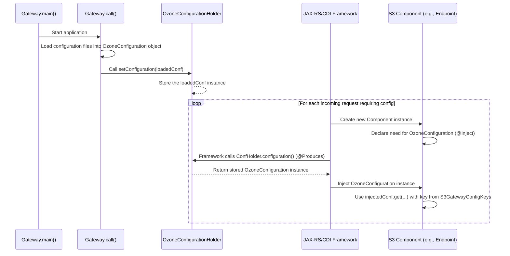

# Chapter 9: Configuration Management

Welcome back! In our journey through the `s3gateway` project, we've explored how it starts ([Chapter 1: Gateway and Servers](01_gateway_and_servers_.md)), processes requests ([Chapter 2: Request Processing Filters](02_request_processing_filters_.md)), handles security ([Chapter 3: S3 Authentication and Authorization](03_s3_authentication_and_authorization_.md)), routes to endpoints ([Chapter 4: S3 Endpoints](04_s3_endpoints_.md)), talks to Ozone ([Chapter 5: Ozone Client](05_ozone_client_.md)), formats data ([Chapter 6: S3 Data Formats and Marshalling](06_s3_data_formats_and_marshalling_.md)), and reports errors ([Chapter 7: S3 Exception Handling](07_s3_exception_handling_.md)). We also looked at common helper code ([Chapter 8: S3 Utilities](08_s3_utilities_.md)).

Now, let's step back and think about how the S3 Gateway knows *how* to do all these things. Where does it get instructions on which network port to listen on, how large of a buffer to use when reading data, or what the domain name is for virtual host style requests?

Imagine our service center again. It doesn't just magically know how to operate. It needs an **operations manual** and a **recipe book**. The operations manual describes procedures, while the recipe book details ingredients and cooking times. Together, they define how everything should run.

In `s3gateway`, this "operations manual" and "recipe book" are represented by its **Configuration**. The configuration holds all the settings and parameters that control the gateway's behavior.

The problem this concept solves is: **How does the S3 Gateway load configuration settings from external sources (like files) and make them easily accessible to all the different parts of the application (filters, endpoints, etc.) that need them?**

This is the job of **Configuration Management**. It involves loading configuration data into a structured object and providing a way for any component to retrieve the specific settings it needs.

## Key Players in Configuration Management

Loading and accessing configuration in `s3gateway` involves a few central pieces:

1.  **`OzoneConfiguration`:** This is the core object that holds all the configuration settings. It's a standard class used across Apache Ozone and Hadoop projects. Think of it as a big map or dictionary where each setting has a **key** (a string, like `"ozone.s3g.http-address"`) and a corresponding **value** (a string, number, boolean, etc.).
2.  **`S3GatewayConfigKeys`:** This is not the configuration itself, but a helper class containing *constants* for the specific *keys* used by the S3 Gateway. It defines standard names for all the settings, making the code easier to read and preventing typos. It's like the index or table of contents for our recipe book, listing all the specific settings needed for S3 Gateway operations.
3.  **`OzoneConfigurationHolder`:** This is a simple class designed to hold the *single instance* of the loaded `OzoneConfiguration` object for the entire application. It makes this central configuration object accessible to other components, primarily through dependency injection. It's like the main copy of the operations manual kept in a central office, available to staff who need to reference it.

## Use Case: An Endpoint Needs a Configuration Setting

Let's take a simple use case: The `ObjectEndpoint` (which handles reading/writing object data - [Chapter 4: S3 Endpoints](04_s3_endpoints_.md)) needs to know the recommended buffer size for streaming data. This buffer size is a configuration setting.

How does the `ObjectEndpoint` get this setting?

1.  The setting key is defined in `S3GatewayConfigKeys`, for example: `OZONE_S3G_CLIENT_BUFFER_SIZE_KEY`.
2.  When the S3 Gateway application starts ([Chapter 1: Gateway and Servers](01_gateway_and_servers_.md)), it loads all configurations (from `ozone-site.xml`, environment variables, etc.) into an `OzoneConfiguration` object.
3.  This `OzoneConfiguration` object is placed into the static `OzoneConfigurationHolder`.
4.  The `ObjectEndpoint` (or its base class `EndpointBase`) declares that it needs an `OzoneConfiguration` object using dependency injection (`@Inject`).
5.  The framework (JAX-RS/CDI) sees this `@Inject` annotation. It knows that `OzoneConfigurationHolder` can *produce* an `OzoneConfiguration` object (via its `@Produces` method).
6.  The framework calls the method in `OzoneConfigurationHolder` to get the loaded `OzoneConfiguration` instance and injects it into the `ObjectEndpoint` instance that's being created for the current request.
7.  Inside the `ObjectEndpoint` code, it can now use methods on the injected `OzoneConfiguration` object (like `getLong()`) and the constant key from `S3GatewayConfigKeys` to retrieve the buffer size value.

## How it Works (High-Level Flow)

Here's a simple flow diagram showing how the configuration is loaded and then accessed:



This diagram shows that the configuration loading is a one-time step during startup, making the configuration available globally via the `OzoneConfigurationHolder`. Then, for every request, the dependency injection framework efficiently provides this *same* configuration object to any component that asks for it.

## Loading the Configuration: `Gateway` and `OzoneConfigurationHolder`

As seen in [Chapter 1: Gateway and Servers](01_gateway_and_servers_.md), the `Gateway` class's `main` and `call` methods are responsible for the initial setup. This is where the `OzoneConfiguration` object is created and populated.

```java
// Simplified snippet from src/main/java/org/apache/hadoop/ozone/s3/Gateway.java
// ... inside Gateway.call() method ...

// Load configuration from default sources (xml files, etc.)
// getOzoneConf() is a helper method in GenericCli base class
OzoneConfiguration ozoneConfiguration = getOzoneConf();

// Place the loaded configuration into the holder so others can access it
OzoneConfigurationHolder.setConfiguration(ozoneConfiguration);

// ... rest of the startup logic (security, servers, etc.)
```

The `getOzoneConf()` method (inherited from a base class) handles reading configuration files like `ozone-site.xml` and `s3-site.xml` if they exist on the classpath. The resulting `OzoneConfiguration` object, holding all the key-value settings, is then passed to the static `OzoneConfigurationHolder.setConfiguration()`.

Now, let's look at the `OzoneConfigurationHolder` itself:

```java
// Simplified snippet from src/main/java/org/apache/hadoop/ozone/s3/OzoneConfigurationHolder.java
public final class OzoneConfigurationHolder {

  // This static field holds the single loaded configuration instance
  private static OzoneConfiguration configuration;

  // Private constructor prevents creating instances of this holder class
  private OzoneConfigurationHolder() {
  }

  /**
   * This method makes the stored configuration available for dependency injection.
   * The framework looks for methods annotated with @Produces.
   */
  @Produces
  public static OzoneConfiguration configuration() {
    // Return the configuration that was set during application startup
    return configuration;
  }

  /**
   * Used during application startup (by Gateway) or testing to set the config.
   */
  // @VisibleForTesting // Annotation indicating this is also used for tests
  public static void setConfiguration(
      OzoneConfiguration conf) {
    // Simple assignment - assumes this is called only once at startup
    OzoneConfigurationHolder.configuration = conf;
  }

  // ... resetConfiguration() for testing ...
}
```

The crucial part is the `static OzoneConfiguration configuration;` field, which keeps the single instance, and the `static OzoneConfiguration configuration()` method annotated with `@Produces`. The `@Produces` annotation is a signal to the dependency injection framework (like CDI, used by Jersey): "Hey, if any component needs an `OzoneConfiguration` instance (e.g., via `@Inject`), call *this* method, and I will give you one." This makes a static field accessible via the dependency injection mechanism.

## Defining Configuration Keys: `S3GatewayConfigKeys`

The `S3GatewayConfigKeys` class is straightforward; it's simply a collection of public static final strings representing the names of the configuration keys used specifically by the S3 Gateway.

```java
// Simplified snippet from src/main/java/org/apache/hadoop/ozone/s3/S3GatewayConfigKeys.java
public final class S3GatewayConfigKeys {

  // Network addresses and ports for the main S3 API server
  public static final String OZONE_S3G_HTTP_ENABLED_KEY =
      "ozone.s3g.http.enabled";
  public static final String OZONE_S3G_HTTP_BIND_HOST_KEY =
      "ozone.s3g.http-bind-host";
  public static final String OZONE_S3G_HTTP_ADDRESS_KEY =
      "ozone.s3g.http-address";
  public static final int OZONE_S3G_HTTP_BIND_PORT_DEFAULT = 9878;

  // Configuration for virtual host style domain names
  public static final String OZONE_S3G_DOMAIN_NAME = "ozone.s3g.domain.name";

  // Security related keys (used for Kerberos, etc.)
  public static final String OZONE_S3G_HTTP_AUTH_TYPE =
      "ozone.s3g.http.auth.type";
  public static final String OZONE_S3G_KERBEROS_KEYTAB_FILE_KEY =
      "ozone.s3g.kerberos.keytab.file";

  // Client/Data transfer related keys
  public static final String OZONE_S3G_CLIENT_BUFFER_SIZE_KEY =
      "ozone.s3g.client.buffer.size";
  public static final String OZONE_S3G_CLIENT_BUFFER_SIZE_DEFAULT =
      "4MB"; // Default value example

  // Feature flags
  public static final String OZONE_S3G_FSO_DIRECTORY_CREATION_ENABLED =
      "ozone.s3g.fso.directory.creation";
  public static final boolean OZONE_S3G_FSO_DIRECTORY_CREATION_ENABLED_DEFAULT =
      true;

  // ... many other keys ...

  private S3GatewayConfigKeys() {
    // Prevent instantiation
  }
}
```

Using these constants (e.g., `S3GatewayConfigKeys.OZONE_S3G_CLIENT_BUFFER_SIZE_KEY`) instead of hardcoding the strings (`"ozone.s3g.client.buffer.size"`) makes the code safer and easier to maintain.

You'll also see `S3SecretConfigKeys` for configuration specific to the S3 Secret management endpoints, following the same pattern.

## Accessing Configuration in Components

Any class managed by the dependency injection framework (like Filters, Endpoints, and Producers) can receive the `OzoneConfiguration` object by simply declaring it as a field and annotating it with `@Inject`.

```java
// Simplified snippet from src/main/java/org/apache/hadoop/ozone/s3/OzoneClientProducer.java
@RequestScoped // This class is managed by the framework (Chapter 5)
public class OzoneClientProducer {

  // Declare that this class needs an OzoneConfiguration object
  @Inject
  private OzoneConfiguration ozoneConfiguration; // The framework will inject it here

  @Produces // This method provides the OzoneClient (Chapter 5)
  public synchronized OzoneClient createClient() throws WebApplicationException, IOException {
    // Now we can USE the injected configuration object!
    // For example, the OzoneClientCache needs it to connect to Ozone.
    client = OzoneClientCache.getOzoneClientInstance(ozoneConfiguration);
    return client;
  }
  // ... rest of the class ...
}
```

```java
// Simplified snippet from src/main/java/org/apache/hadoop/ozone/s3/endpoint/EndpointBase.java
public abstract class EndpointBase implements Auditor {

  // Endpoints also need the configuration
  @Inject
  private OzoneConfiguration ozoneConfiguration; // Injected by the framework

  // Endpoint-specific init method is called after dependencies are injected
  public abstract void init();

  // ... in a child class's init() or another method ...
  @Override
  public void init() {
    // Access the configuration and read specific settings
    long bufferSize = ozoneConfiguration.getStorageSize(
        S3GatewayConfigKeys.OZONE_S3G_CLIENT_BUFFER_SIZE_KEY,
        S3GatewayConfigKeys.OZONE_S3G_CLIENT_BUFFER_SIZE_DEFAULT,
        StorageSize.Unit.B); // Example: get buffer size

    boolean fsoDirCreationEnabled = ozoneConfiguration.getBoolean(
        S3GatewayConfigKeys.OZONE_S3G_FSO_DIRECTORY_CREATION_ENABLED,
        S3GatewayConfigKeys.OZONE_S3G_FSO_DIRECTORY_CREATION_ENABLED_DEFAULT); // Example: get feature flag
    // ... use these settings ...
  }
  // ... rest of the class ...
}
```

In both examples, the `@Inject private OzoneConfiguration ozoneConfiguration;` line is all that's needed. The framework, using the `@Produces` method in `OzoneConfigurationHolder`, automatically provides the correct configuration instance. The code then uses standard `OzoneConfiguration` methods like `getStorageSize()`, `getBoolean()`, `getLong()`, `getTrimmedStrings()` to read the value associated with a specific key from the loaded configuration. Using the constants from `S3GatewayConfigKeys` makes it clear which setting is being accessed.

This pattern makes configuration access clean and consistent across the entire `s3gateway` application. Any component that needs a setting simply declares its need via `@Inject`, and the framework delivers the shared configuration object.

## Back to the Use Case

Let's finalize our use case: `ObjectEndpoint` needs the buffer size.

1.  The `ObjectEndpoint` inherits from `EndpointBase`.
2.  `EndpointBase` has `@Inject private OzoneConfiguration ozoneConfiguration;`.
3.  When a new `ObjectEndpoint` instance is created for a request, the framework injects the configuration object (obtained from `OzoneConfigurationHolder`).
4.  In the `ObjectEndpoint`'s `init()` method (or elsewhere if needed), it calls `ozoneConfiguration.getStorageSize(S3GatewayConfigKeys.OZONE_S3G_CLIENT_BUFFER_SIZE_KEY, ...)` to get the buffer size value.
5.  This value is then used in the `put` or `get` methods when interacting with the [Ozone Client](05_ozone_client_.md) to determine how much data to read/write at a time.

This simple mechanism ensures that the buffer size used for data transfer is easily configurable outside of the code itself.

## Conclusion

In this chapter, we explored **Configuration Management** in `s3gateway`. We learned that the `OzoneConfiguration` object holds all the application settings, and `S3GatewayConfigKeys` provides standard names for these settings. The `OzoneConfigurationHolder` acts as a singleton container for the loaded configuration, making it available application-wide. By leveraging dependency injection (`@Inject` and `@Produces`), any component in `s3gateway` can easily obtain and use the application's configuration settings in a clean and standardized way. This allows the gateway's behavior to be customized externally without modifying the code.

With our understanding of how the gateway is configured, we can now look at how it exposes metrics about its operation, which is crucial for monitoring its health and performance.

[Chapter 10: Metrics](10_metrics_.md)

---

Generated by [AI Codebase Knowledge Builder](https://github.com/The-Pocket/Tutorial-Codebase-Knowledge)