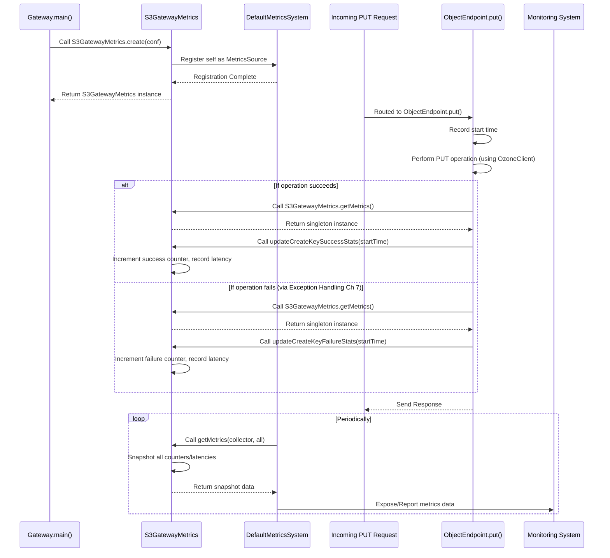

# Chapter 10: Metrics

Welcome back! In our previous chapter, [Chapter 9: Configuration Management](09_configuration_management_.md), we saw how the S3 Gateway loads and manages its settings, allowing it to be customized without changing the code.

Now that our S3 Gateway is running, configured, processing requests, talking to Ozone, formatting data, and handling errors, how do we know if it's performing well? Is it fast? Is it handling many requests? Are there lots of errors happening internally?

Imagine our service center manager needs to see how the business is doing. They don't just hope for the best; they track key performance indicators (KPIs). How many customers were served today? What was the average wait time? How much of each product was sold? This information helps them understand efficiency, identify bottlenecks, and make decisions.

In the world of software services like `s3gateway`, these KPIs and operational statistics are called **Metrics**.

The problem this concept solves is: **How does the S3 Gateway collect and expose information about its own performance and operational health, such as how many requests it handles, how long they take, and how much data is transferred?**

This is the role of the **Metrics** subsystem. It tracks key numbers that are crucial for monitoring the health and performance of the service.

## What are Metrics?

Metrics are essentially numerical data points that give you insight into how your application is behaving. In `s3gateway`, this includes things like:

*   **Operation Counts:** How many times a specific S3 operation (like `PutObject`, `GetObject`, `ListBuckets`) has been attempted, both successfully and unsuccessfully.
*   **Latency:** How long each operation takes to complete, often measured in nanoseconds or milliseconds. This helps identify slow operations.
*   **Data Transfer:** The total number of bytes read from or written to Ozone for `GetObject` and `PutObject` operations.
*   **Error Rates:** The ratio of failed operations to total operations.

`s3gateway` uses the standard Apache Hadoop/Ozone Metrics2 framework to collect and expose these metrics. This framework allows monitoring systems (like Prometheus, Ganglia, etc., depending on configuration) to easily collect the data from the running S3 Gateway process.

The main class responsible for collecting and holding these metrics is `S3GatewayMetrics`.

## Key Players

1.  **`S3GatewayMetrics`:** This is the central class. It defines all the individual metrics (counters and latency timers) that the S3 Gateway tracks. It's registered with the global Hadoop Metrics system.
2.  **Metrics System (Hadoop/Ozone's DefaultMetricsSystem):** This is the underlying framework that manages the registration of metrics sources (like `S3GatewayMetrics`), collects data from them periodically, and exposes the data (e.g., via JMX or a web endpoint).
3.  **Endpoints and Filters:** The classes that actually perform the work of handling S3 requests (like the Endpoints we saw in [Chapter 4: S3 Endpoints](04_s3_endpoints_.md)) are responsible for *updating* the metrics in the `S3GatewayMetrics` instance as operations succeed or fail.
4.  **`@Metric` Annotation:** This annotation, part of the Hadoop Metrics2 framework, is used in the `S3GatewayMetrics` class to automatically create and manage the actual metric objects (like `MutableCounterLong` for counts or `PerformanceMetrics` for latency).

## Use Case: Tracking Object Uploads

Let's consider how we would track the number of successful object uploads (`PutObject` operations) and their latency.

1.  An S3 client sends a `PUT` request to upload an object ([Chapter 1: Gateway and Servers](01_gateway_and_servers_.md)).
2.  The request passes through filters ([Chapter 2: Request Processing Filters](02_request_processing_filters_.md), [Chapter 3: S3 Authentication and Authorization](03_s3_authentication_and_authorization_.md)).
3.  The JAX-RS framework routes the request to the `ObjectEndpoint`'s `put()` method ([Chapter 4: S3 Endpoints](04_s3_endpoints_.md)).
4.  *Before* performing the upload logic, the `put()` method gets the current time (start time).
5.  The `put()` method interacts with the [Ozone Client](05_ozone_client_.md) to write the data.
6.  If the upload succeeds, the `put()` method calls a specific method on the `S3GatewayMetrics` instance (e.g., `updateCreateKeySuccessStats()`), passing the start time.
7.  The `updateCreateKeySuccessStats()` method increments the counter for successful uploads and adds the duration (current time - start time) to the latency metric.
8.  The Metrics System periodically queries the `S3GatewayMetrics` instance, reads the accumulated counts and latency data, and makes them available for monitoring.

## How it Works (High-Level Flow)



This diagram shows the lifecycle: the `S3GatewayMetrics` instance is created once at startup and registered. Then, endpoints update the relevant metrics during request processing. The Metrics System periodically gathers this data.

## Looking at the Code

Let's peek into the `S3GatewayMetrics` class and how endpoints interact with it.

### The `S3GatewayMetrics` Class

This class defines and manages the metrics.

```java
// Simplified snippet from src/main/java/org/apache/hadoop/ozone/s3/metrics/S3GatewayMetrics.java

@Metrics(about = "S3 Gateway Metrics", context = OzoneConsts.OZONE) // Annotation for the Metrics System
public final class S3GatewayMetrics implements Closeable, MetricsSource {

  // Use @Metric annotation to define counters and latency trackers
  private @Metric MutableCounterLong createKeySuccess; // Counter for PutObject success
  private @Metric MutableCounterLong createKeyFailure; // Counter for PutObject failure

  @Metric(about = "Latency for successfully creating an S3 object key in " +
      "nanoseconds")
  private PerformanceMetrics createKeySuccessLatencyNs; // Latency for success

  @Metric(about = "Latency for failing to create an S3 object key in " +
      "nanoseconds")
  private PerformanceMetrics createKeyFailureLatencyNs; // Latency for failure

  private @Metric MutableCounterLong putKeySuccessLength; // Data bytes written

  // ... many other @Metric fields for other operations (Get, Delete, List, etc.) ...

  private static S3GatewayMetrics instance; // Singleton instance

  private S3GatewayMetrics(OzoneConfiguration conf) {
    // Constructor sets up the registry and initializes PerformanceMetrics
    this.registry = new MetricsRegistry(SOURCE_NAME);
    // PerformanceMetrics need intervals configured via Configuration Management (Chapter 9)
    int[] intervals = conf.getInts(S3GatewayConfigKeys
        .OZONE_S3G_METRICS_PERCENTILES_INTERVALS_SECONDS_KEY);
    performanceMetrics = PerformanceMetrics.initializeMetrics(
        this, registry, "Ops", "Time", intervals);
    // Note: Metrics like MutableCounterLong are typically initialized automatically by the framework
  }

  // Static method to create and register the singleton instance
  public static synchronized S3GatewayMetrics create(OzoneConfiguration conf) {
    if (instance == null) {
      MetricsSystem ms = DefaultMetricsSystem.instance();
      instance = ms.register(SOURCE_NAME, "S3 Gateway Metrics",
          new S3GatewayMetrics(conf)); // Register with the system!
    }
    return instance;
  }

  // Static method for other classes to get the singleton instance
  public static synchronized S3GatewayMetrics getMetrics() {
    return instance;
  }

  // Method to update the metrics for a successful PutObject operation
  public long updateCreateKeySuccessStats(long startNanos) {
    createKeySuccess.incr(); // Increment the success counter
    long value = Time.monotonicNowNanos() - startNanos; // Calculate duration
    createKeySuccessLatencyNs.add(value); // Add duration to latency tracker
    return value; // Return duration (optional, but useful)
  }

  // Method to update the metrics for a failed PutObject operation
  public void updateCreateKeyFailureStats(long startNanos) {
    createKeyFailure.incr(); // Increment the failure counter
    createKeyFailureLatencyNs.add(Time.monotonicNowNanos() - startNanos); // Add duration to latency tracker
  }

  // Method to record the number of bytes written for a successful PutObject
  public void incPutKeySuccessLength(long bytes) {
    putKeySuccessLength.incr(bytes); // Add bytes to the counter
  }


  @Override // This method is called by the Metrics System
  public void getMetrics(MetricsCollector collector, boolean all) {
    MetricsRecordBuilder recordBuilder = collector.addRecord(SOURCE_NAME);

    // For each metric, snapshot its current value to the collector
    createKeySuccess.snapshot(recordBuilder, true);
    createKeySuccessLatencyNs.snapshot(recordBuilder, true);
    createKeyFailure.snapshot(recordBuilder, true);
    createKeyFailureLatencyNs.snapshot(recordBuilder, true);
    putKeySuccessLength.snapshot(recordBuilder, true);

    // ... snapshot other metrics ...
  }

  @Override // Called when the gateway shuts down
  public void close() {
    // Clean up resources (e.g., PerformanceMetrics timers)
    IOUtils.closeQuietly(performanceMetrics.values());
  }

  // ... many other update... and get... methods for other metrics ...
}
```

This code shows:
*   How `@Metric` fields define the specific metrics to track.
*   How the static `create()` method is used to register the instance with the `DefaultMetricsSystem`.
*   How methods like `updateCreateKeySuccessStats()` are called by the endpoint code to increment counters and update latency timers.
*   How the `getMetrics()` method (implementing `MetricsSource`) is the interface the Metrics System uses to pull data.

### Using Metrics in Endpoints

Now, let's see how the `ObjectEndpoint` uses `S3GatewayMetrics` to record the object upload (PutObject) metrics.

```java
// Simplified snippet from src/main/java/org/apache/hadoop/ozone/s3/endpoint/ObjectEndpoint.java
public class ObjectEndpoint extends EndpointBase { // Inherits from EndpointBase

  // ... injected dependencies and configuration ...

  /**
   * Rest endpoint to upload object to a bucket.
   * Handled by PUT /{bucket}/{path}
   */
  @PUT // Handles PUT requests to "/{bucket}/{path:.+}"
  public Response put(
      @PathParam("bucket") String bucketName,
      @PathParam("path") String keyPath,
      @HeaderParam("Content-Length") long length,
      // ... other parameters ...
      final InputStream body) // The actual object data!
      throws IOException, OS3Exception {

    // --- Step 1: Record start time ---
    long startNanos = Time.monotonicNowNanos(); // Get current time in nanoseconds
    S3GAction s3GAction = S3GAction.CREATE_KEY; // Action for audit logs

    try {
      // ... logic to interact with Ozone Client to create key and write data (Chapter 5) ...

      long putLength = 0; // Track bytes written
      try (OzoneOutputStream output = getClientProtocol().createKey(/* ... */)) {
         putLength = IOUtils.copyLarge(body, output, /* ... */); // Write data
      }
      // ... Calculate ETag etc. ...

      // --- Step 2: Update SUCCESS metrics ---
      // Get the singleton metrics instance and call the update methods
      getMetrics().updateCreateKeySuccessStats(startNanos); // Increment success count, add latency
      getMetrics().incPutKeySuccessLength(putLength); // Record bytes written

      // Log success audit (Chapter 8)
      AUDIT.logWriteSuccess(buildAuditMessageForSuccess(s3GAction, getAuditParameters()));

      // Return success response (Chapter 6)
      return Response.ok(/* ... */).build();

    } catch (Exception ex) {
      // --- Step 3: Update FAILURE metrics ---
      getMetrics().updateCreateKeyFailureStats(startNanos); // Increment failure count, add latency

      // Log failure audit
      AUDIT.logWriteFailure(buildAuditMessageForFailure(s3GAction, getAuditParameters(), ex));

      // Handle and re-throw S3 exceptions (Chapter 7)
      throw ex;
    }
  }

  // Helper method (likely in EndpointBase) to access the metrics singleton
  protected S3GatewayMetrics getMetrics() {
    return S3GatewayMetrics.getMetrics(); // Uses the static getter
  }

  // ... other methods ...
}
```

This snippet demonstrates:
*   Using `Time.monotonicNowNanos()` to get the start time before the operation begins.
*   Calling `getMetrics().updateCreateKeySuccessStats(startNanos)` inside the `try` block to record a successful operation and its duration.
*   Calling `getMetrics().updateCreateKeyFailureStats(startNanos)` inside the `catch` block to record a failed operation and its duration.
*   Calling `getMetrics().incPutKeySuccessLength(putLength)` after successfully writing data to record the size.
*   Accessing the `S3GatewayMetrics` singleton via the static `getMetrics()` helper method.

This pattern of capturing start time, performing the operation, and then calling the appropriate update method on the metrics instance is repeated across all endpoint methods for every S3 operation to collect comprehensive statistics.

## Back to the Use Case

By implementing this pattern in the `ObjectEndpoint.put()` method, the `s3gateway` successfully tracks every object upload. The `createKeySuccess` and `createKeyFailure` counters tell us the total number of successful and failed uploads, respectively. The `createKeySuccessLatencyNs` and `createKeyFailureLatencyNs` measure how fast (or slow) those operations were. Finally, `putKeySuccessLength` gives insight into the volume of data being transferred. This information is invaluable for operators monitoring the S3 Gateway.

## Conclusion

In this chapter, we explored the **Metrics** subsystem in `s3gateway`. We learned that the `S3GatewayMetrics` class, using `@Metric` annotations, defines and manages the key performance indicators and operational statistics. This class registers itself with the Hadoop Metrics System, which collects the data. We saw how endpoint methods (like the `put()` method in `ObjectEndpoint`) are responsible for updating these metrics by calling specific methods on the `S3GatewayMetrics` singleton instance, typically recording success/failure counts, latency, and data transfer sizes. This comprehensive metrics collection is essential for monitoring the S3 Gateway's health and performance in a production environment.

This concludes our beginner-friendly tutorial on the core concepts of the `s3gateway` project. We've covered everything from how it starts and receives requests to how it processes them, handles security, interacts with Ozone, manages configuration, and provides vital metrics. Hopefully, this journey has given you a solid foundation for understanding the project's architecture and contributing to its development!

---

Generated by [AI Codebase Knowledge Builder](https://github.com/The-Pocket/Tutorial-Codebase-Knowledge)