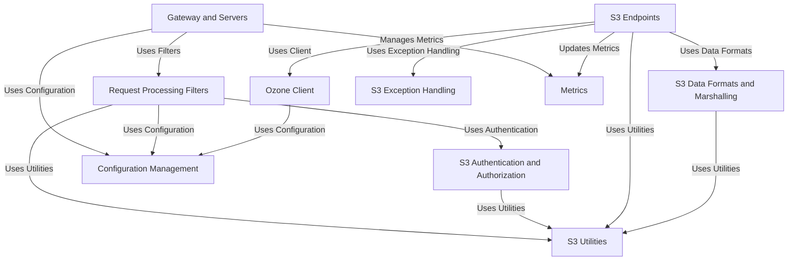

# Tutorial: s3gateway

The Ozone S3 Gateway provides an **S3-compatible API** for accessing the Apache Ozone distributed storage system.
It acts as a **translator**, receiving S3 requests, authenticating and processing them through a pipeline of *filters*,
and then interacting with the backend Ozone cluster via an *Ozone client* to perform operations on buckets and objects.
Responses are then formatted back into *S3 data formats*.

**Source Repository:** [None](None)

## Chapters

1. [Gateway and Servers
](01_gateway_and_servers_.md)
2. [Request Processing Filters
](02_request_processing_filters_.md)
3. [S3 Authentication and Authorization
](03_s3_authentication_and_authorization_.md)
4. [S3 Endpoints
](04_s3_endpoints_.md)
5. [Ozone Client
](05_ozone_client_.md)
6. [S3 Data Formats and Marshalling
](06_s3_data_formats_and_marshalling_.md)
7. [S3 Exception Handling
](07_s3_exception_handling_.md)
8. [S3 Utilities
](08_s3_utilities_.md)
9. [Configuration Management
](09_configuration_management_.md)
10. [Metrics
](10_metrics_.md)

---

Generated by [AI Codebase Knowledge Builder](https://github.com/The-Pocket/Tutorial-Codebase-Knowledge)